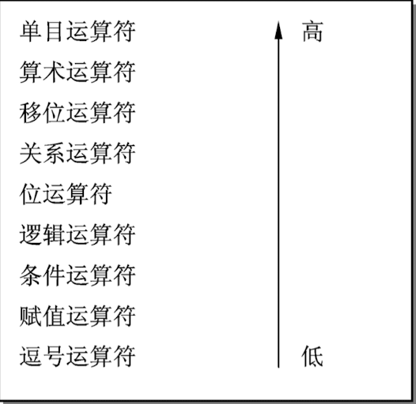
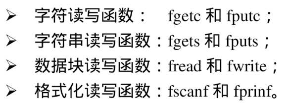

# C语言 

## 第一章

### 1.1 十进制转换二进制
（1）整数转换
除，反着写
（2）小数部分转换
小数点后 乘，正着写

#### 1.1.1 二、八、十六进制转换
八进制基数 是2的三次幂
十六进制 2的四次幂

1. 二 ---> 八
 <u>001</u> <u>101</u> 

2. 八 ---> 二
	3位看

3. 二 ---> 十六
	4位  <u>1001</u>

### 1.2  机器数表示形式
1.原码
符号位： 正0		负数1
正负数的原码都相同，符号位变化

2.反码
（正） 与原码相同
（负）求反(符号位不动)
101010 -->(反)110101


3.补码
（正）与原码相同
（负）按位求反，末位加1 [符号位不动]

### 1.3 二进制位运算
1. 与运算（&）
	有0则0，两同(1)才同(1)
2. 或运算（｜）
	有1则1，两个不同(0)才不同(0)
3. 非运算（～）
	求反
4. 异或运算（^）
	同0异1
	

题1：将二进制数10110010的高4位求反，低4位不变的操作是
	答：与(F0)16 按位异或


## 第二章程序设计基础
### 2.1编制C步骤
编辑 -->编译-->链接

### 2.2琐碎知识点
1. C语言是由多个函数构成

2. a --> 97

   A -->65 
   中间差32
   0 --> 48


## 第三章基本数据类型、运算符与表达式
### 3.1 C语言数据类型
1. 基本类型
	占字节：
		-1.int     	 2 / 4
		-2.short      2
		-3.long  	 4
		-4.float 	  4
		-5.double   8
		-6.char  	 1

### 2. 常量、变量和标识符
1. 标识符
	- 1. 命名规则：
		>由<b>字母、数字、下划线</b>组成
		>第一个字母必须是字母或下划线
		>关键字不能做变量名

2. 常量
	- 用#define定义
	- 注意：
	
	 			1. 定义时，行尾不能有分号
	 			2.define是预处理命令，不是C语言语句
3. 变量
	必须先定义，后使用

### 3.3 简单数据类型与表示范围
1. 整型数据
	- 1. 整型常量
		八进制--> 0开头
		十六进制--> 0x开头

2. 内存表示
	**正数的数值在内存中用补码的形式存放**
>小例子：
> -65537：对于16位单元来说，先计算补码： 01 0000 0000 0000 0001-->（求反+1）10 1111 1111 1111 实际存放的为1111 1111 1111 1111 为 -1 而不是 -65537
> 同理： 65535 存放是1 
>  -65535 存放是 1

3. 实型数据
  - 1. 指数形式
  	a E n , a为十进制数， n为十进制整数
  - 2. 实行变量分类和定义
      >1. 单精度： float -->%f
      float 小数点后要有六位。最多能表示八位数字，如果没到八位，最后追加的数字是随机的

      >2. 双精度：double -->%lf 

4. 常用转义字符及其含义
- 1. 字符型常量
>1. 转义字符算一个字符
>2. \\ \表示 \  ;     \"表示 "
>3. \ddd : 1~3位八进制数 所代表的字符，d的值可以是 0～7 的任意数字 
>4. \xhh：1～2位十六进制数所代表的字符， h的值可以是 0~f的任何字符
```c
char a = '\' ; //报错
char a = '\x'; //报错
char ch = '\2344'; //错！八进制最多有3个 ；正：'\234'
char ch = '\x23w'; //错，x后只能有1～2位
strlen("\123456"); // 4位数: \123 4 5 6
strlen("\x234"); //报错
```


- 2. 字符串常量
	> 1. 字符常量只能是单个字符，字符串常量可以含一个或多个字符
	> 2. 字符常量占1个字节的内存空间

 	>	3. <b>字符串常量占的内存字节数等于字符串中字节数+1</b>
 	> <b>+1的这个字节中存放字符'\0' (ASCII 码为0)</b>
 	>	sizef() --->字节数+1
 	>	strlen --->字节数

5. 简单数据类型的表示范围
	- 1. 整型
		int(16) , 2字节 , -32768 ~ 32767,
		short ,2字节 , -32768 ~ 32767,
		unsigned int(16) , 2字节 , 0~65535,
		unsigned short  , 2字节 , 0~65535,
		char , 1字节 , -128 ~ 127,
		unsigned char , 1字节 , 0 ~ 255,

6. 数据简单输出
	- 1. 格式控制字符：
	>%d:有符号整型，int、 short
	%u:无符号
	%f:float
	%c:字符型，char
	%s:字符串

7. 强制类型转换符
	- 1. 自动转换
	（1）无符号 短 --->长
	<b>高位补0</b>
	（2）有符号 短--->长
	<b>高位补第一位的数字</b>
	- 2. 强制转换
	long double 
	⬆️
	double  < ----    float 	（只要有float就会转乘double）
	⬆️
	long
	⬆️
	unsigned int 
	⬆️
	int < ----- char , short
	(从右到左是必须转换的)


### 3.4 运算符和表达式
1. 算术运算符、算术表达式
	- 1. 算术运算符
		%只能用于整数
		优先级：类型强制转换运算符>算术运算符>赋值运算符
	- 2. 自增自减运算符、负号运算符
		前置运算--->  ++ / -- 变量：先增/减 后运算
		后置运算--->  变量++ / -- ：先运算 后增/减 
>使用方法：
>1:i+++j :相当于(i++)+j 先将i+j赋值给p,然后i增1
>2:i+++--j：相当于(i++)+(--j) 先对j减1，然后算i+j
>3:i+++i++: 相当于(i++)+(i++)想将i+i赋值，再自增2次
>4:++i+(++i):相当于(++i)+(++I)先把i自增2次，然后算i+i

2. 位运算符、位运算表达式
	- 1. 左移运算(<<   乘2)
	高位丢掉，空出的低位用零填补
	- 2. 右移运算（>>   除2）
	空出的高位用原来的符号填补（负用1，正用0）
	- 3. 移位运算符必须都是整型数


### 3.5 运算符的优先级和结合性
```c
	<从下到上，从低到高>
	>()
	>~;++;--;-(负号);sizeof				从右向左
	>*;/;%
	>+;-(减法)
	><<;>>
	>&
	>^
	>|
	>=;+=;==;/=;*=;%=;^=;&=;|=     从右向左
	>,
```

### 3.6 琐碎知识点
1. %只能用于int 和char 型变量
2. m是个三位数，从左到右用a , b , c表示		
	-->百：m/100;  十：(m/10)%10;  个：m%10
3. 先定义后赋值
4. 注意变量的表示的范围


## 第四章 基本输入/输出
### 4.1 格式化输出printf
1. 整数的输出
	%  [-] / [+] / [.] / [width] / [l] / [h]
	>[-]：表示输出的数据左对齐，默认右对齐
	>[+]：表示加上+号
	>[width]：无符号整数，表示输出整数的最小域宽（占屏幕的多少格）
	>[.] :无符号整数，表示至少要输出多少位，如果整数的位数小于这个数，需要在左边的空位上补0
	>[l]：输出长整型数据
	>[h]：输出短整型数据

```c
    int a = 123;
    long L = 65537;
    printf("a=%6d-----(a=%%d)\n",a);
    //输出：a=   123-----(a=%6d)
    printf("a=%-6d-----(a=%%-6d)\n",a);
    //输出：a=123   -----(a=%-6d)
    printf("a=%-06d-----(a=%%-06d)\n",a);
    //输出：a=123   -----(a=%-06d)
    printf("a=%+06d-----(a=%%+06d)\n",a);
    //输出：a=+00123-----(a=%+06d)
    printf("a=%+6.6d----(a=%%+6.6d)\n",a);
    //输出：a=+000123----(a=%+6.6d)
    printf("a=%-6.5d-----(a=%%-6.5d)\n",a);
    //输出：a=00123 -----(a=%-6.5d)
    printf("a=%6.4d-----(a=%%6.4d)\n",a);
    //输出：a=  0123-----(a=%6.4d)
    prinf("%hd",L);
    //输出：1 ，65537的十六进制：0x0001 0001 ，取低十六位，则为1
```

2. 实数的输出
	
	% [.] / [#] / [width] / [.] / [l|L]
>[#] :必须输出小数点,如果是别的进制，如八进制，需要把前面的0输出来
>[.] :规定输出实数时，小数部分的位数
>[l] :输出double型数据；默认也是输出double数据
>[L] ：输出long double 型数据

3. 字符和字符串的输出
	输出字符： %[-] / [0] / [width]  c
	输出字符串： %[-] / [0] / [width] /[.] s
>[.] :表示只输出字符串的前多少个字符

注意：
>1:如果上一个不正常的输出会影响到下一个表达式的正常输出
>	 如：printf("a = %d, b = %d\n",f,b)  // float f =2; int a =10,b=100;
>	 输出的f用了float但是用了%d，则不会正常输出2.000000
>	 后面的b会被影响输出


### 4.2 格式化输入scanf
>scanf("格式控制字符串",变量地址);
>&只能作用于变量，不能作用于表达式，因为表达式不对应具体的内存单元，没有地址，只有值

1. 控制符
 \* ：为抑制符，输入的数据不会复制给相应的变量
2. 注意：
	>使用格式控制符%c输入耽搁字符时候，空格和转义字符均作为有效字符被输入
	>scanf("%2d%*2d%3d",&num1,&num2);  // 输入123456789
	>printf("num1=%d,num2=%d\n",num1,num2); //读取12赋值给num1；读取34舍掉；读取567赋值给num2. 输出结果：num1=12 , num2=567


### 4.3 字符数据的非格式化输入和输出
1. 字符数据的非格式化输入
	- 1. getchar
			返回值是用户输入的第一个字符
			该函数没有参数，<b>有一个int型返回值</b>。
			调用该函数的时候，程序就等待用户按键
	- 2. getc
			int getc (FILE \*stream);
			从流文件stream中读取一个字符信息，当流文件时stdin时，和getchar完全相同
	- 3. getche
		int getche(void);
		和getchar相同，唯一差别是：getche直接从键盘获取键值，不等待用户按回车键，只要用户按，则getche直接返回用户按键的ASCII码，同时用户输入的字符回显在屏幕上。
	- 4. getch
		和getche功能相同，唯一差别为：getche回显输入的字符，但是getch不回显输入的字符。


2. 字符数据的非格式化输出
	- 1. putchar(int c)
		在显示器上输出的字符c
	- 2. putc(int c, FILE * stream)
		将字符输出到流文件stream，如果流文件为stdout，功能与putchar相同
	- 3. puts(char * string)
		将字符串string的所有字符输出到屏幕上，<u>输出时将自动回车换行</u>

3. 清除键盘缓冲区
	fflush

### 4.4 碎小知识点
1. 格式转换符中，除了X、E、G以外，其他均为小写字符。
2. 算法的描述方法：自然语言描述、伪代码、流程图、N-S图


## 第五章选择结构程序设计
### 5.1 关系运算符、逻辑运算符、条件运算符
1. 关系运算符，关系表达式
	
	>(优先级) 算术运算符>移位运算符>关系运算符>&、 |、 ^>赋值运算符
	>
	>[> , >= , < , <= 的优先级大于== ,  !=]


2. 逻辑运算符，逻辑表达式

   | 逻辑运算符 | 含义                         | 结合性 |
   | ---------- | ---------------------------- | ------ |
   | !          | 单目运算符，逻辑非，表示相反 | 右结合 |
   | &&         | 双目运算符，逻辑与，表示并且 | 左     |
   | \|\|       | 双目运算符，逻辑或，表示或者 | 左     |

   ||：两边式子只要有一个式子为真，整个逻辑表达式的值就是真（即为1），否则为假（0）。
   &&：两边都是真，才为真，有一个不真则是假。&&优先级>||

   >**逻辑与，左边为0，则右边的不进行计算！！**
   >例子:
   	```c
   	int a = 1, b = 2, c = 3, d = 4, m = 2, n = 2; 
    	//执行 (m=a>b)&&(n=c>d)后的N的值为：
   	  //左边的M 为0；则后面的 n=c>d 不进行计算，n的值为2.
   	```

   ！：单目运算符，当右边的式子为真，整个为假；否则为真。

   >(优先级) !、~、++、--、sizeof > 算术运算符 > 移位 > 关系 > &、|、^ > &&、|| > 赋值

3. 条件运算符和条件表达式
	条件运算符为？和：，这是一个三目运算符
	**条件表达式的一般形式为：表达式1 ? 表达式2 : 表达式3**
	
	<规则>：如果表达式1的值为真，则表达式2的值作为条件表达式的值，否则以表达式3的值作为整个条件表达式的值。
	使用条件表达式时，还应注意以下几点：
	
	>1.条件运算符可嵌套，例如：x > 0? 1:(x < 0 ? -1 : 0) 表达式的值是：如果X是正数，则是1，如果是负数，则为-1，如果为0，则为0.
	>2.条件运算符 ? 和 : 是一堆运算符，不能分开单独使用。
	>
	> [> , >= , < , <= 的优先级大于== ,  !=]
	>位运算符： & > ^ > |  (第一章 0，1那个)
	>逻辑运算符：&& > ||


### 5.2 选择结构的程序设计
#### 5.2.1 IF语句
1. if 语句
表达式：
```c
if(表达式)
  语句;
```
```c
if(a = 5); //表达式永远是非0
if(b); //等价于if(b!=0)


```

2. if-else 语句
表达式：
```c
if(表达式)
 	语句1;
else
  语句2;
```

3. if-else-if 语句
```c
if(表达式1)    语句1;
else if(表达式2)  语句2;
else if(表达式3)  语句3;
else  语句N;
```
4. 注意
	- 注意关键词之后均为表达式，注意 真，非
	- C语言规定，在缺少{ }时，else 总是和它上面离他最近的为配对的if 配对

#### 5.2.2 switch语句
1. 介绍
格式：
```c
//形式：
switch(表达式){
case 常量表达式 C1: 语句组1;
								break;
case 常量表达式 C2: 语句组2;
								break;
default: 语句组;
			break;
			}
```


2. 执行过程为：

- 当switch后面“表达式”的值，与某个case后面的“常量表达式”的值相同时，就执行case后面的语句组；当执行到break语句时，跳出switch语句，转向执行switch语句的下一条。
- 如果没有任何一个case后面的“常量表达式”的值与“表达式”的值匹配，则执行default后面的语句，在执行switch语句的下一条

注意：
>1. switch后面的表达式，可以是<u>int 、 char 和枚举类</u>中的一种
>
>2. case后面的表示的值需要不相同。
>
>3. case后面必须是常量表达式，不能含变量
>	如果后面的是常量，可以考虑用if-else-if
>	
>4. 多个case子句，可以使用同一个语句，最后break。
>
> ```c
>   case 1:
>   case 2:
>   case 3: b+=2;break;
> ```
>
>5. switch语句可以嵌套
>
> ```c
>   void main(){
>   int x=1,y=0,a=0,b=0;
>   switch(x){
>   	case 1: switch(y){
>   					case 0: a++; break;
>   					case 1: b++; break;
>   					}
>   	case 2: a++; b++; break;
>   	case 3: a++; b++; break;
>   }
>   printf("%d ,%d",a,b);
>   }
> ```
>6. 几个小案例，具体看文件：<chapter5_book.c>

#### 5.3 注意事项

1.表达式

>1. 对于表达式(k)?(i++):(i--)来说，其中的表达式k等价于 <u>k!=0</u>
>解释：表达式可以理解为：k为真返回i++ ; k为假返回i--
>C语言中非0表示真，0表示假，k为真用k!=0表示
>2. 与运算，左为0，右边不算


## 第六章 循环结构
### 6.1  循环结构的程序设计
#### 6.1.1 while 语句

```c
  while (表达式) //表达式中可以是任意类型的表达式
  语句;	 //循环体
```
执行过程：
>首先判断表达式的值是否是真（非0），如果是真，则执行循环体内的语句，然后再判断表达式是否为真，如果是真，在执行循环体内的语句，如此往复，直到表达式为假（0）为止。

注意：
>1. 如果while后面的表达式一开始就是假，循环体讲一次也不执行
>2. 退出循环：1）：表达式为假（0） 
>						          2）：循环体中遇到break，return，goto 语句
>3. 要注意循环变量的增值，如果不增，很容易变成死循环

```c
	#include<stdio.h>
	void main(){
		int m, n, r;
		printf("Please input two postive inteager:\n");
		scanf("%d%d",&m, &n);
		while(n != 0)
		{
		r = m % n; //求余数
		m = n;
		n = r;
		}
		printf("Their greatest common divisor is %d\n",m);
	}

```

#### 6.1.2 do- while语句
1. 一般形式
```c
do
	语句;  //循环体
while(表达式); //循环条件
```
执行过程：
>首先执行循环体内的语句，然后才判断表达式的值是否为真（非0），如果为真，则再执行循环体内的语句，如此循环往复，知道表达式的值为假（0）为止。

注意：
>1. do-while语句和while语句的区别的在于do-while是先执行后判断，因此<u>do-while至少要执行一次循环体</u>。而while是先判断后执行，如果条件不满足，则循环体语句一次也不执行。
>2. 如果 do-while 后的表达式的值一开始就是假，循环体还是要执行一次
>3. <u>do-while语句的表达式后面必须加分号。</u>


#### 6.1.3 for 语句
1. 一般形式
```c
for(表达式1;表达式2;表达式3)  //循环条件
	语句;  //循环体
```
要求：
>表达式1:一般为赋值表达式，给控制变量赋初值。
>表达式2：关系表达式或逻辑表达式，循环控制条件。
>表达式3:一般为赋值表达式，给控制变量增量或减量

执行过程：
>首先，求表达式1的值，然后判断表达式2是否为真（非0），如果为真，则执行循环体语句，然后求表达式3的值。接下来再判断表达式2是否为真，如果为真，继续执行循环体语句以及求表达式3的值，直到表达式2为假为止。

#### 4. break 与 continue 语句
1. break语句
	break语句的作用是在循环体中测试到应立即结束循环时，使控制立即跳出循环结构，转而执行循环语句后的第一条语句。

	注意：
	>1. break只能用于while、do-while、for语句构成的循环结构中和switch选择结构中。
	>2. break语句只能终止并跳出包含它的最近一层的循环体。
	>3. 在嵌套循环的情况下，如果想让break语句跳出最外层的循环体，需要设置标志变量tag，然后在每层循环后加上一条语句: if(tag) break; 其值为1表示跳出循环体，为0则不跳出。

2. continue语句
**continue语句和break语句不同，当在循环体中遇到continue语句时，程序将跳过continue语句后面尚未执行的语句，开始下一次循环，即只结束本次循环的执行，并不终止整个循环的执行。**

注意：
>1. continue语句只能用于while、do-while、for语句构成的循环结构中。
>2. 在嵌套循环中，continue语句只对包含它的最内存的循环体语句起作用。

#### 5. go to 语句
goto语句也称为无条件转移语句。
```c
	goto 语句标号;
	
	语句标号;
```

应用：
>1. goto 语句可与条件语句配合使用来实现条件转移，构成循环
>	```c
>		int tag = 0;
>		for(...)
>	{
>		while(...)
>																																																																																																																																																																																			
> 	{
> 	  ..
> 	   if(..) goto stop;
> 	..
> 	}
> 	 ..
> 	}	
> 		stop:for循环后第一条语句
> 	```
>	2. 在嵌套循环的条件下，利用goto语句可以直接从最内层的循环体跳出最外层的循环体。

#### 6. exit()函数

`void exit(int status);   头文件<stdlib.h>`
exit( )作用时：终止整个程序的执行，强制返回操作系统

### 2 循环结构类型的选择和转换
1. 循环结构类型选择
>1. 如果循环次数在循环体之前就已经确定，一般使用for 循环；如果循环次数时由循环体的执行情况确定的，一般用while循环或者do-while循环。
>当循环体至少执行一次时，使用do-while循环，反之，如果循环体可能一次也不执行，使用while循环。

2. 循环结构类型之间的相互转换


### 3 循环结构程序设计
1. 验证哥德巴赫猜想：任意充分大的偶数，都可以用两个素数之和表示。
```c
/*
思路：输入一个偶数N，将它分为p和q，使= p + q;
让p从2开始，每次增加1，而令q = n - p;如果 q and p是素数，则正为所求，否则令p = p + q再尝试。

要点：判断是否是素数，我们可以领两个表示量：flagp,falgq,初始值为0；若p是素数，令flagp =1,若q是素数，令flagq=1

*/

	#include<stdio.h>
	#include<stdlib.h>
	#include<math.h>
	
	void prime_number(){
		int i, n, p, q, flagp, glagq;
		printf("please input n:");
		scanf("%d",&n); 
		if(n<4 ||n%2!=0) //如果这个数不是偶数
		{
			printf("input data error!\n");
			exit(-1); //程序结束
		}
		
		p=1;
		do{
			p++;
			q = n - p;
			//Determine whether p is prime
			flagp = 1;
			for(i=2;i<=(int) sqrt(p);i++){
			if(p % 1 ==0){
				flagp=0;
				break;
			}
			}
			//Determine whether p is prime
			flagq = 1;
			for(i =2; i<=(int)sqrt(q);i++){
				if(q % i ==0){
					flagq = 0;
					break;
				}
			}
		}while(flagq * flagq ==0); //p q 中有一个不为素数时，继续循环
		printf("%d = %d + %d\n",n,q,p);
	}
```

2. 打印大小可变的菱形图案
```c
	/*
							*
						* * *
					* * * * *
				* * * * * * *
				  * * * * *
				    * * *
              *
关键：1. 确定每行*的个数：当行数i(假设最上面的一行为第一行)<=(size+1)/2时，该行的个数为 n = 2*i-1 ；
否则，n = 2*(size-i+1)-1；
	*/
#include<stdio.h>
#include<stdlib.h>

void rhombus()
{
		int i, j, k, m, n, size;
    pritnf("input size:"); 
    scanf("%d",&size);
    if(size <=0 || size %2 ==0)
    {
    	printf("error!\n");
    	exit(-1);
    }
    for(i = 1;i<=size ;i++) //控制行数
    {
    	n = (i<=(size+1)/2)?i:size-i+1; //每行中"*"号的个数
    	n=2*n-1;
    	m=(size-n)/2+15; //每行打印 * 之前应打印的空格数
    	for(k=1;k>=m;k++)  //打印每行前面的空格
    		printf(" ");
    	for(j =1;j<=n;j++) //打印每行的 *
    		printf("*");
    	printf("\n");  //打印一行后，回车换行
    }
}

```

3. 统计两个整数之间的所有整数中0、1、2、3、4、5、6、7、8、9数码的个数
```c
/*
	问题的关键在于要计算某整数中包含的各个数码的个数，必须对该整数进行分解，求得包含的各个数码，其方法可以通过每次除以10取余数得到，然后对商进行同样的处理，直到商为0时为止。
*/
#include<stdio.h>
#include<stdlib.h>

void statistics(){
	int num1, num2;
	int n,s,r;
	int count0=0,count1=0,count2=0,count3=0,count4=0,count5=0,count6=0,count7=0,count8=0,count9=0;
	printf("input two intrger:");
	scanf("%d%d",&num1,&num2);
	if(num1<0||num2<||num1>num2){
		printf("input error!\n");
		exit(-1);
	}
	for(n=num1;n<num2;n++){
		s = n;
		do{
			r =s % 10;
			switch(r){
					case 0:count0++;break;
					case 1:count1++;break;
					case 2:count2++;break;
					case 3:count3++;break;
					case 4:count4++;break;
					case 5:count5++;break;
					case 6:count6++;break;
					case 7:count7++;break;
					case 8:count8++;break;
					case 9:count9++;break;
			}
			s = s / 10;
		}while(s != 0);
	}
	printf("0 == %-4d  1 -- %-4d 2 -- %-4d 3-- %-4d\n",count0,count1,count2,count3);
	printf("4 == %-4d  5 -- %-4d 6 -- %-4d 7-- %-4d\n",count4,count5,count6,count7);
	printf("8 -- %-4d 9 -- %-4d\n",count8,count9)
}

```
4. （重要）利用下面的公式求PI 的近似值，要求累加到最后一项小于10的-6次幂为止。公式：PI /4 ~1-1/3+1/5-1/7....

```c
	#include<stdio.h>
	#include<math.h>
//累加项可以找规律 t = s / n; 其中s可以用s = -s实现; n按照1，3，5变化，n = n+2
void main(){
  int s =1;
  float n =1.0, t =1, pi=0;
  while(fabs(t)>=1e-6){
    pi +=t;
    n+=2;
    s=-s;
    t = s/n;
  }
  pi *=4;
  printf("pi = %.6f\n",pi);
}

```


### 4  注意事项
1. 需要在do-while循环语句的后面一定要加分号
2. while循环是先判断后执行，而do-while循环是先执行后判断。
while循环中循环一次可能不执行循环体，而do-while语句是要执行一次循环体。
3. break语句在循环体中的作用是：跳出循环结构，转而执行循环语句后的第一条语句
4. continue语句在循环体中的作用是：结束本次循环，循环执行下一次循环
5. 注意：
```c
	t =0;
	while (printf("*")){ //这里的意思为： 返回字符串中*字符的个数，这里是一个，所以返回1，相当于while(1)；这个相当于循环控制表达式与'0'等价
			t++;
			if(t<3)
				break;
	}
```


## 第七章 数组
### 7.1 一维数组
#### 7.1.1 一维数组的定义和引用
1. 定义
`存储类型符  数据类型符  数组变量名[整型常量表达式]`
说明：
>1. 数组定义时，必须指定数组的大小，**数组大小必须是整型常量表达式**，不能是变量活变量表达式
>2. 计算数组所占内存单元的字节数的公式：
>		数组所占内存单元的字节数 = 数组大小 * sizeof(数组元素类型)

2. 一维数组的引用
数组是一种数据单元的序列，不能直接存取整个数组，只能引用数组中的各个数据单元。
引用数据单元的格式为：`数组变量名[下标]`
下标的最小值是0，最大值则是数组大小减1。

#### 7.1.2 一维数组的赋值
1. 一维数组的初始化赋值
格式：`数据类型符 数组变量名[常量表达式] = {表达式1，表达式2，....，表达式n};`
```c
	//例如:
				int a[4] = {1,2,3,4}
				/*
				a[0]=1,
				a[1]=2,
				a[2]=3
				a[3]=4
				*/
```

注意：
>在定义数组时，如果没有为数组变量赋初值，那么就不能省略数组的大小。而且数组不初始化，其数组元素的值为随机值。

<b>赋值方法:</b>

（1）使用赋值语句来逐一赋值

适用于长度较小的数组或对长度较大的数组部分元素赋值。

```c
int a[4];
a[0]=1;a[1]=2;a[2]=3;a[3]=4;
char str[80];
str[0]='b';str[1]='y';str[2]='e';str[3]='\0';
```

（2）使用循环语句来逐一赋值
适用于对某数组元素进行有规律的赋值或接受用户通过键盘输入对数组元素的赋值。

```c
	int a[10],i;
	for(i=0;i<10;i++)
	a[i] = 2 * i + 1;
		
	//接受用户解盘输入赋值给数组各元素
	int b[10],i;
	for(i=0;i<10;i++)
		scanf("%d",&a[i]);
```

（3）使用memset函数赋值
标准库函数memset可实现对某内存块的个字节单元整体赋<u>同样的数值</u>。
`void *memset(void *s, char ch, unsigned n)`
功能：将s为首地址的一片连续的n个字节内存单元都赋值为ch（注意：是对内存的每个字节单元都赋值为ch）
	
（4）使用memcpy函数实现数组间的赋值
对于两个数据类型和大小相同的数组，如果将其中一个数组各单元的值要赋值给另一个数组的个数据单元，我们可以使用循环赋值也可以使用memcpy函数
`void *memcpy(void *d, void *s, unsigned n)`
功能：<u>将s为首地址的一片连续的n个字节内存单元的值拷贝到以d为首地址的一片连续的内存单元中</u>。

2. 一组数组的应用举例
（1）输入一行字符，统计其中各个大写字母出现的次数
```c
#include<stdio.h>
#include<memory.h>
void statistics_array(){
	char ch;
	int num[26],i;
	memset(sum,0,26*sizeof(int)); //初始化数组num
	while((ch = getchar())!='\n'); //输入字符串，判断统计
		if(ch>='A' && ch<='Z') //是否为大写字母
			num[ch-'A']++;
	
	for(i = 0;i < 26;i++){
		if(i%9 = 0)
			printf("\n");
		printf("%c(%d)",'A+i',num[i]);
	}
	printf("\n");
}

```

（2）用冒泡排序法讲10个整数按照从小到大的顺序排序
```c
/*
思路：假设数组又N个数组元素，采用冒泡排序法对该数组进行排序，从下标为0的元素开始，比较相邻的两个元素的大小，每次比较如果前面的元素大于后面的元素，则交换这两个元素的值。
每一轮冒泡排序都能有一个最大/最小值归位
*/
#include<stdio.h>
#define NUM 10
void pop(){
	int a[NUM], i, j, t;
	printf("input %d number \n",NUM);
	for(i=0;i<NUM;i++)
		scanf("%d",&a[i]);
		
	for(i= 1；i<NUM；i++) //轮次共NUM-1次
		for(j=0;j<NUM-i;j++) //实现一次冒泡操作
			if(a[j] > a[j+1])
				{
					t = a[j];
					a[j] = a[j+1];
					a[j+1] = t;
				}
	printf("the sorted numbers:\n");
	for(i=-;i<NUM;i++)
		printf("%d",a[i]);
}

//改进后的冒泡操作
void updatepop(){
	int a[SUM], i, j, t;
	int flag;
	printf("input %d number \n",NUM);
	for(i=0;i<NUM;i++)
		scanf("%d",&a[i]);
	
	for(i= 1；i<NUM；i++) //轮次共NUM-1次
		{
			flag = 0;
			for(j=0;j<NUM-i;j++) //实现一次冒泡操作
				if(a[j] > a[j+1])
					{
						t = a[j];
						a[j] = a[j+1];
						a[j+1] = t;
						flag =1;
					}
					if(flag ==0) break;
				}
	printf("the sorted numbers:\n");
	for(i=-;i<NUM;i++)
		printf("%d",a[i]);
	}
}
```

### 7.2  二维数组
#### 7.2.1 二维数组的定义和引用
`存储类型符 数据类型符 数组变量名[整型常量表达式1][整型常量表达式2]`
应用格式：`数组变量名 [下标1] [下标2]`
规定相同，都是从0开始到该维长度减1
二维数组在屋里上采用按行存储的顺序存储方式，我们称这种存储顺序为以行序为主序的顺序存储结构

>对于数据单元在内存的地址可通过下面的公式计算：
>**有效地址=数组的起始地址+（下标1 * 第一堆大小 + 下标2）*sizeof(元素类型)**

#### 7.2.2 二维数组的赋值
1. 二维数组的初始化赋值
（1）分行初始化
`存储类型符 数据类型 数组变量名[行常量表达式][列常量表达式] = {{第0行初值表},{第1行初值表}...{最后1行初值表}};`
例子：`int a[2][3] ={{1,2,3},{4,5,6}};//对数组元素全部赋值`

注意：可以省略前者部分赋值，但是必须要写出第二维的大小

`int a[][3]={{1,2},{4}};//对数组元素部分赋值，省略第一维大小`

（2）按元素在内存中的排列顺序初始化赋值
`存储类型符 数据类型 数组变量名[行变量表达式][列变量表达式] ={初值表};`
赋值规则：按二维数组中元素在内存中的排列顺序，将初始表中的数据，依次赋给各个元素。
例子：`int a[2][3]={1,2,3,4,5,6};//对数组元素全部赋值`

2. 二维数组在程序中赋值
	可以使用库函数memset/memcpy等方法来进行
	例子：`memset(a,0,6*sizeof(int)); //可以把数组中的个元素清0`
	`int b[2][3];memcpy(b,a,6*sizeof(int)); //将数组a个元素的值赋值到数组b的个元素中` 

### 7.3  字符串和数组
#### 7.3.1 字符串本质
字符串是一种字符型数组，并且这个数组的最后一个单元的是'\0'，也就是说，字符串是一种以'\0'结尾的字符数组
```C
char str[]="china"; //数组大小为6
//等价于：
char str[]={'c','h','i','n','a','\0'};
```
注意：
>在用字符串数组来存放某个字符串常量时，如果要指定字符数组的大小，那么其大小至少要比字符串的长度大1（多了一个单元用于存'\0'）

#### 7.3.2 字符及字符串操作的常用函数
1. 字符串的输入
（1）gets函数
`gets(字符数组变量名);`
功能：接受键盘的输入，将输入的字符串存放在字符数组中，直到遇到回车换行符时返回。但是回撤换行符'\N'不会作为有效字符存储。gets函数能接受包含空格字符的字符串。
注意：
>用于接受字符串的字符数组定义时的长度应足够长，以便保存整个字符串和字符串结束标志，否则，函数将把超过字符数组定义的长度之外的字符顺序保存在数组范围之外的内存单元中。

（2）scanf函数
在输入字符串时使用%s格式控制符，并且与%s对应的地址参数应该是一个字符数组，任何时候都会忽略前导空格，读取输入字符并保存到字符数组中，直到遇到空格符或回车符输入操作便终止了。scanf函数会自动在字符串后面加'\0'
为了避免输入的字符长度超过数组的大小，可以使用%ns格式控制符，N代表域宽限制，如果没有遇到空格字符，那么读入操作将在读入N个输入字符之后停止。

2. 字符串输出
（1）puts函数
`puts(字符串地址);`
将字符串中的所有字符输出到终端上，<u>输出时将字符串结束标'\0'转换成换行符'\n'</u>，使用puts函数输出字符串是无法进行格式控制

（2）printf函数
printf函数在输出字符串时，使用%s格式控制符，<u>并且与%s对应的地址参数必须是字符串第一个字符的地址，printf函数将依次输出字符串</u>
输出字符串时还可以定义更多的格式，%ns可以同时制定字符串显示的宽度。如果字符串的实际长度小于N个字符，不足部分填充空格。
N为正数，则在左端补空格，即字符串右对齐。
N为负数，则字符串做对齐，如果字符串的长度大于N个字符，则显示整个字符串。

```c
	printf(">>%8s<<\n","John");
	printf(">>%-8s<<\n","John");
	printf(">>%8s<<\n","John Smith");
	
	输出结果时：
	>>    John<<
	>>John    <<
	>>John Smith<<
```

3. 字符串的长度
求字符串长度的库函数 Strlen
`strlen(字符串的地址);`
功能：返回字符串中包含的字符个数（不包含'\0'），即字符串的长度。注意，字符串的长度是指从给定的字符串的起始地址开始到第一个'\0'为止。
注意：
>字符串中需要注意转义字符
>char str[ ]="0123<u>\045</u>6789";
>printf("%d",strlen(str));  //输出结果为9，将把\045作为一个转义字符来看待
>printf("%d",strlen(&str[5])); //输出结果为4

4. 字符串的复制
  字符串的复制不能使用复制运算符“=”，而必须使用strcpy、 strncpy 、memcpy函数
  （1）strcpy函数
  `strcpy(字符数组1,字符串2);`
  功能：将**字符串2复制到字符数组1中去（包括\0）**strcpy的第一个参数必须是一个字符数组变量，也可以是一个字符串常量。

（2）strncpy函数
`strncpy(字符数组1,字符串2,长度n);`
功能：**将字符串2的前N个字符复制到字符数组1中去，并在末尾加'\0'**，因此strncpy函数可实现字符串的部分复制。当N大于或等于字符串2的长度时，strncpy等价于strcpy

5. 字符串的比较
  不能用大于、小于来进行比较，需要用strcmp 、stricmp 、strncmp 、strnicmp等库函数来完成

  （1）strcmp函数
  `strcmp(字符串1,字符串2);`
  功能：比较两个字符串的大小，如果字符串1大于字符串2，则返回一个正整数，如果字符串1小于字符串2，则返回一个负整数；如果字符串相等，则返回0

字符串比较的规则：
>将两个字符串逐一字符比较ASCII码大小，直到遇到不同的字符或者'\0'为止，如果全部字符都相同，这两个字符数组相等。如果出现不相同的字符，则以第一个不相同的字符的比较结果作为判断两个字符数组的大小的标准。

（2）stricmp函数
这个函数调用与strcmp相同，其功能也是比较两个字符串的大小，**但是stricmp函数在比较两个字符串时，不区分大小写**。

（3）strncmp函数
`strncmp(字符串1,字符串2,长度n);`
功能：**将字符串1前N个字符的子串与字符串2前N个子串进行比较**，返回值与strcmp相同

（4）strnicmp函数
**调用与strncmp相同，但是这个不区分大小写**

6. 字符串的连接
`strcat(字符数组1,字符串2);`
功能：将字符串2连接到字符数组1的后面（包括'\0'），其中，字符串2没有变，而字符数组1中的字符将增加了

#### 7.3.3 字符串数组
当构成数组的数据时字符串时，这个数组就称为字符串数组。字符串数组实际上是字符型的二维数组，这个二维数组的每一行都是存放字符串的字符数组。
还可以按照如下的方式进行初始化：
`存储类型符 char 字符串数组名[行数m][列数n] = {字符串1,字符串2,...,字符串m};`
其中，每个字符串的长度应小于n-1（因为字符串的结尾符'\0'占用一个单元）

### 7.4  本章小结、注意事项
1. 不能用变量来等一数组大小
>int n =10;
>int a[n]; //错误：不能用变量来指定数组的大小

2. 数组赋初值时，需要用{ }，且，{ }中至少有一个值
3. 数组间复制可以使用循环语句赋值，也可以使用memcpy函数来实现
	如果是将一个字符串复制到另一个字符数组中，也可以使用strcpy函数
4. 利用==比较字符串是否相等（X）
>不能用==，需要用strcmp / stricmp函数
>**if(strcmp(str,"wang")==0)**

5. 利用=来进行复制字符串
	需要用strcpy / strncpy 函数
> strcpy(str,"1234");

6. 接受字符串时，使用去地址运算符& （X）
>因为数组本身就是代表地址，因此不需要加上&
>正确 ： scanf("%s",str);

7. 赋值注意: 
(1)对数组赋值字符串,其数组的大小应为字符串的长度加1
(2)如果赋值是一个字符赋值的话,如:{'a','b'} 则没有'\0'
```c
char x[]= "abcdefg";
char y[]={'a','b','c','d','e','f','g'};
X的数组长度要大于Y的数组长度
```

## 第八章 函数
### 8.1  函数概述

### 8.2  函数的定义与调用
#### 8.2.1 无参数无返回值的函数
1. 函数的定义
```c
void 函数名(void)
{
	变量声明部分
	执行部分
}
```
2. 函数的用途
3. 函数的原型声明

`void 函数名(void); 或 void 函数名();`
4. 函数的调用

`函数名();`

( )中不能有void
5. 函数的返回
可以利用return

`return(表达式) //有返回值; return 表达式 //有返回值; return //无返回值;`

#### 8.2.2 无参数有返回值的函数
1. 函数的定义
```c
返回值类型符 函数名()
{
	变量声明部分
	执行部分
}
```
>函数的返回值通常是函数计算的结果或执行的状态信息. 返回值通常是int(不写的话)
>函数的返回值将由 return(表达式)或renturn 表达式 ; 语句返回给调用者(即调用这个函数的另一个函数).表达式的值即是函数的返回值. 一般情况下,表达式的值的类型应与函数返回值类型一致.

2. 函数的用途
3. 函数的原型声明
`返回值类型符 函数名(void); 或 返回值类型符 函数名();`
4. 函数的调用
`函数名(); 或 变量 = 函数名();`

5. 函数的返回
<u>当return(表达式)语句中的表达式的类型与函数的返回值类型不一致时,将表达式的值强制转换成函数返回值的类型.</u>

#### 8.2.3 带参数无返回值的函数
1. 函数定义
```c
void 函数名(类型符1 形参名1,类型符2 形参名2 .... )
{
	变量声明部分
	执行部分 	    //这两个部分就是函数体
}
```
>形参类似于函数变量声明部分中的变量,当函数定义时,变量可以有初值,但是形参却没有初值. 当函数被调用时,形参才会有值.


2. 函数的用途
该类函数根据形参的值来进行某种事物的处理. 有了形参之后,调用函数可以把不同处理的值通过形参传递给被调用函数, 被调用函数可以根据形参的值来进行对应的处理.

3. 函数的原型声明
`void 函数名(类型符1 形参名1, 类型符2 形参名2 ....);`
`void 函数名(类型符1 , 类型符2 ....)`

4. 函数的调用
`函数名(实参列表)`

实参列表时用逗号分隔的表达式.
>对于调用带实参的函数时要注意两点:
>实参列表中的实参必须与函数定义时的形参数量相同、类型相同
>实参表求值顺序(即实参赋值给形参的顺序), 因系统而定. <u>VC 是从右到左</u>

```c
void compare(int a, int b); //also (int ,int) 
void main(){
	int i=2;
  compare(i,i++); //函数调用(i为实参)
  printf("i = %d\n",i);
}

void compare(int a , int b) //函数定义,有形参无返回值(a,b为形参)
{
	printf("a = %d b= %d\n",a,b);
	if(a>b)
		printf("a>b\n");
	else
		if(a == b)
			printf("a=b\n");
		else
			printf("a<b\n");
}
```

5. 函数返回
因为该类型的函数无返回值,所以如果要在函数体内中途返回给条用函数,只有通过 return; 语句返回即可

#### 8.2.4 带参数有返回值的函数
1. 函数的定义
```c
返回值类型 函数名 (类型符1 形参名1, 类型符2 形参名2 ....)
{
	变量声明部分
	执行部分
}
```
>如果省略返回值类型符,默认int 
>函数的返回值将由return(表达式); 或 return 表达式; 语句返回给调用者(调用这个函数的另一个函数)

2. 函数的用途
3. 函数的原型声明 
`返回值类型符 函数名(类型符1 形参名1, 类型符2 形参名2 ....);`
`返回值类型符 函数名(类型符1 , 类型符2 ....)`

4. 函数的调用
`函数名(实参列表);`
`变量名 = 函数名(实参列表)`

```c
int max(int a ,int b);

void main()
{
	int a,b,c;
	scanf("%d%d",&a,&b);
	c = max(a,b);
	printf("the biggest number is %d",c);
	//also write:
	printf("the biggest number is %d",max(a,b));
}

int max(int a ,int b)
{
	return (a>b?a:b);
}
```

5. 函数的返回
函数题内一般会有return(表达式) 或者 return 表达式

### 8.3  函数参数的传递方式
通常有 <b>值传递方式</b> 和 <b>地址传递方式</b>
1. 运用值传递方式
函数调用时,为形参分配内存单元,并将实参的值复制到形参中.
特点:形参与实参占用不同的内存单元,函数中对形参值的改变不会对实参进行改变. 这就是函数参数的值单向传递规则.

```c
include <stdio.h>
void swap (int a, int b) ;

void main ( )
{
	int x=7, y=11;
	printf ("before swapped: ");
	printf ("x=%d, y=%d\n", x, y);
	swap (x, y);
	printf("after swapped: ") ;
	printf ("x=%d, y=%d\n", x, y) ;
}

void swap (int a, int b)
{
	int temp; 
	temp = a;
	a = b;
	b = temp;
}
```

为什么会出现这种情况,因为在内存单元中没有作任何的改变, 这只是形参在发生改变

2. 运用地址传递方式
函数调用时,将实参数据的存储地址作为参数传递给实参.

特点:形参与实参占用同样的内存单元, 函数中对形参值的改变也会改变实参的值。所以该地址传递的方式可以实现调用函数与被调用函数之间的双向数据传递。
注意:形参和实参必须时地址变量或变量。

比较典型的地址传递方式就是用数组名作为函数的参数,在用数组名作函数参数时,不是进行值的传送,即不是把实参数组的每一个元素的值都赋予形参数组的各个元素. 因为数组名就是数组的首地址,因此在数组名作函数参数时所进行的传送只是地址的传送,也就是说把实参数组的首地址赋予形参数组名

> 注意:
> 形参数组和实参数组的类型必须一致
> 形参数组和实参数组的长度可以不相同,因为在调用时,只传送首地址而不检查形参数组的长度.
> 多为数组也可以作为函数的参数,在函数定义时,对形参数组可以指定每一纬的长度,也可以省去第一纬的长度.

### 8.4 变量的作用域和生存期
1. 作用域和生存期概念
- 变量的作用域:变量的作用范围(有效范围)
	作用域分: 1. 局部变量 2.全局变量
- 变量的生存期
	变量在程序开始执行开始占用内存,在程序执行的过程中,只有必要时才为变量分配内存. 当变量占用内存时,变量就生成了. 当变量不使用的时候,程序将释放变量所占用的内存,变量就撤销了. 从变量生成到消失的这段时间就是变量的生存期.

2. 局部变量的作用域与生存期
(1) 局部变量
局部变量是在函数内作定义说明的, 作用域仅限于函数内.
>注意:
>主函数 main中定义的变量也是局部变量,只能在主函数中使用,
>形参变量属于被调用函数的局部变量;  
>实参变量属于调用函数的局部变量
>在符合语句中定义的变量也是局部变量,其作用域只在符合语句范围内.

(2)全局变量
全局变量也为 外部变量.
作用域是从变量定义处到程序文件的末尾

>全局变量可加强函数模块之间的数据关系,使得这些函数依赖于全局变量,让函数的独立性降低.
>在同一文件中,全局和局部变量可以一样,如果使用全局变量,则必须在变量名前加上两个冒号 ‘::’
>引用全局变量: `extern 类型说明符 全局变量名1 , ..... 全局变量名n ;`


### 8.5 变量的存储类型
静态存储类型的变量:通常是在变量定义时就分配内存单元并一直保持不变,直至整个程序结束. (全局变量就是这种)
动态存储类型变量:使用时才分配,使用完立即释放 (形式参数)
>auto(自动型)
>register(寄存器型)
>extern(外部型)
>static(静态型)

1. 自动变量(auto)
说明符为auto, 属于动态存储类型
`[auto] 数据类型说明符 变量名1, 变量名2,....变量名n`
auto可以省略, 自动变量只能在函数内或复合语句中定义 --->属于局部变量
注意: 在函数外部定义的没有带存储类型说明符的全局变量,如 int k; 并不代表是自动变量,而是外部变量,属于静态存储类型.

2. 外部变量(extern)
属于静态存储类型

3. 静态变量(static)
属于静态存储类型的变量不一定就是静态变量.
(1)静态局部变量
在局部变量的说明前加上static 就构成静态局部变量
`static int a, b;`
`static float array[5] = {1,2,3,4,5};`
- 静态局部变量属于静态存储方式,它与自动变量相比有以下特点:
>静态局部变量与自动变量均属于局部变量,都是在函数内或复合语句中定义.但自由变量是在调用函数或指定复合语句时才生成,推出函数或者符合语句时就消失. 而静态局部变量时在调用函数或执行复合语句之前就生成,退出函数或复合语句后仍然存在, 变量将保持现有的值, 直到程序终止时才消失. <u>它的生存周期为整个源程序.</u>
>静态局部变量作用域与自动变量相同.
><u>对静态局部变量若在定义时为赋初值, 则系统自动赋初值0。</u>
>虽然离开定义它的函数后不能使用,但是在此调用定义它的函数时候,它还可以继续使用,并不会被消除,而且保存了前次被调用后留下的值.

(2)静态全局变量
全局变量(外部变量)的说明之前再冠以static就构成了静态全局变量. 全局变量本身就是静态存储方式.
主要的区别:
- 非静态全局变量的作用域是整个源程序,当一个源程序由多个源文件组成时,非静态的全局变量在各个源文件中通过外部变量说明都是有效的
- 静态全局变量则限制了其作用域,即只在定义该变量的源文件内有效,在同一源程序的其他源文件中不能通过外部变量说明来使用它.

4. 寄存器变量(register)
这个放在CPU的寄存器中,使用时,不需要访问内存,直接从寄存器中读写,这样可提高效率.
说明:
>只有局部自动变量和形式参数才可以定义为寄存器变量. 
>寄存器变量属于动态存储类型

### 8.6 函数的嵌套和递归调用
1. 运用函数的嵌套调用
  示意图
  

```c
//计算三个数中最大数与最小数的差
#include<stdio.h>

int dif(int x, int y, int z);
int max(int x, int y, int z);
int min(int x, int y, int z);

void main()
{
	int a, b, c, d;
	scanf("%d%d%d",&a,&b,&c);
	d = dif(a,b,c);
	printf("Max - Min = %d\n",d);
}

int dif(int x, int y, int z)  //求三数中的最大值与最小值的差
{
	return (max(x,y,z)-min(x,y,z));
}

int max(int x, int y, int z) // find max number
{
	int r;
	r = x > y ? x : y;
  return (r > z ? r : z);
}

int min(int x, int y, int z)
{
	int r;
	r = x < y ? x : y;
	return(r < z ? r : z);
}
```

2. 运用函数的递归调用
  直接递归调用和间接递归调用


说明:
>递归函数主要用于解决具有递归性质的问题
>每调用函数一次,在内存堆栈区需分配空间,用于存放函数变量、返回值等信息.

```c
//打印数字三角形
#include<stdio.h>

void printf(int w);

void main()
{
	int i;
	if(w!=0)  //递归结束的条件
	{
		print(w-1);
		for(i = 1; i <= w; ++i){
			prtinf("%d",w);
		}
		printf("\n");
	}
}

```

```c
	//求N的阶乘 N!
	/*
	1. 可以用for 做出一个非递归函数 factn1
	long factn1(int n)
	{
		long L =1;
		int i;
		for(i=1;i<=n;i++){
			L *=i;
		}
		return(L);
	}
	*/
	//2. 用递归函数来写
	long fact(int n) //递归函数求n!
	{
		long L;
		if(n==1)
			return(1);
		L = n* fact(n-1);
		retrun(L);
	}
	
	//主函数
	void main()
	{
		int n;
		long L;
		scanf("%d",&n);
		L = fact(n);
		printf("%d! = %ld\n",n,L);
	}
```


[递归调用及堆栈变化示意图(factn1)]


[递归调用示意图( fact( ) )]

编写递归函数有两个要点:
>1. 确定递归公式, 是实现递归函数的模版
>2. 根据公式确定递归函数的出口,即结束递归调用的条件

### 8.7 函数的作用域
1. 内部函数
内部函数: 如果在一个源文件中定义的函数只能被本文件中的函数调用,而不能被同一源程序其他文件中的函数调用.
`static 类型说明符 函数名(形参表)`
例如:
```c
	static int func(int a, int b)
	{
		return (a > b ? a : b);
	}
```
内部函数也称静态函数,但此处静态static的含义不是指存储类型,而是指对函数的作用域只局限于本文件.

2. 外部函数
外部函数在整个源程序中都有效
`extern 类型说明符 函数名(形参表)`
如果函数定义中没有说明extern或static 则隐含为 extern.

## 第9章 指针
### 9.1 指针与指针变量的概念
1. 内存地址——内存中存储单元的编号
2. 变量地址 ---- 系统分配给变量的内存单元的起始地址
3. 指针与指针变量
  (1) **<u>指针即是地址</u>**
  指针实际上就是内存地址. 
  (2)指针变量就是专门用于存储其他变量地址的变量
  一个指针变量的值就是某个内存单元的地址(或指针)
  
  

“指针”是指地址,是常量.
“指针变量”是指取值为地址的变量.
定义指针的目的是为了通过指针去访问内存单元

### 9.2 指针变量的定义和引用

1. 变量值的存取方法
2. 指针变量的定义
定义格式: `[存储类型] 数据类型符 *变量名`
定义说明:
>数据类型符可以是任何一种有效的数据类型标识符,是指针变量所之乡的内存房源的数据类型

(1)单个指针变量的定义
`int *p1;`
P1是一个指针变量,它的值是某个整形变量的地址.
`staic int *p2`
P2是指静态整型变量的指针变量.

(2)一条语句中同时定义普通变量和指针变量
`float *p3, a; 或者 int a, *p3`

(3)一条语句中定义多个指针变量
`char *p4 ,*p5`

注意:
><u>定义指针变量时, *号和变量名是一个逻辑整体</u>
>指针变量也是变量
><u>int *p 定义的指针变量是P</u>

3. 指针变量的赋值
指针变量的赋值只能赋予地址.
(1)指针变量初始化的方法 
`int a; int *p = &a;`
**`p、 &a、 &(*p) `这些都是A的地址.**
(2)赋值语句的方法
`int a; int *p; p = &a;`
**`a *p *(&a)`这些都是A的值.**
注意:
>1. 赋值语句中,被赋值的指针变量P的前面不能加 *
>2. 不能用auto变量的地址去初始化static型指针
>3. ‘*’ 和 ‘&’ 是相反的类型:  * 取数值 , & 取地址

4. 零指针与空类型指针
(1)零指针(空指针)
指针变量的值为0的指针. 其表示形式为 `int *p=0;` 表示P指向地址为0 的单元,系统保证该单元不作它用,表示指针变量值没有意义. 也可以写成: `#define NULL(void *)0.  int *p=NULL`
定义零指针的用途主要表现在两个方面:
>1. 避免指针变量的非法引用
>2. 在程序中常作为状态比较
>例如:`int *p; ..... while(p!=NULL) {....}`

(2)void * 类型指针
表示形式为 `void *p;` 表示不指定p 是指向哪一种数据类型的指针变量. 使用时要进行强制转换.

5. 引用指针变量
当一个指针指向一个变量时,程序就可以利用这个指针间接引用这个变量. 间接引用的格式为: `*指针变量`. 在指针变量说明中, " * "是类型说明符, 表示其后的变量是指针类型, 而表达式中出现的 “ * ”则是一个运算符用以表示指针变量所指的变量.
```c
int a ;
int *p = &a; //P指向A
*p = 10;  //相当于A =10;
```
注意: 
> “ * ” 是间接引用运算符,是单目运算符,优先级与++ , -- 相同,具有右结合性.
> 上面的 程序中,与A++等价的表达式是( * p)++, 而不是 * p++.
> 因为 * p++相当于 * (p++), 其中的++ 是作用于p的,而不是作用于 * p.
> 程序在利用指针间接引用内存单元时,将按照指针变量定义时指向的数据类型来解释引用的内存单元.
```c
/*
不同类型的指针操作同一内存变量
*/
void main()
{
	unsigned short a;
	unsigned short *pi = &a;
	char *pc = (char *)&a;
	
	*pi = 0xF0F0;
	*pc = 0;
	printf("a=%X",a);
}

//输出: A= F000

/*程序说明: pi是指向short型数据的指针,因此pi可操作整个a所对应的内存单元, *pi就是a
但pc是指向char 型数据的指针,只能操作a的低字节单元, *pc 不是short型数据,而是char型数据,所以说, *pc不是a,而是a 的低字节
*/
```
执行前:

执行后:


```c
/*输入两个数,并使其从大到小输出*/
void main()
{
	int *p1, *p2, *p, a, b;
	
	scanf("%d,%d",&a,&b);
	p1 = &a; p2 = &b; //P1指向变量a, p2指向变量b
	if(a<b)
	{ 					//将 p1,p2所指向的变量地址交换
		p=p1;
		p1=p2;
		p2=p;
	}
	printf("a =%d , b=%d\n",a,b); 
	printf("max = %d, min = %d\n",*p1,*p2);
}
//输入 10  20
//运行结果: a = 10, b = 20
	//				max =20 ,min=10;
```
注意:
>指针变量必须先定义,后赋值,最后才能使用!  没有赋值的指针变量是没有任何意义的,也是不能使用的
>指针变量只能指向定义时所贵姓类型的变量

### 9.3 指针的地址运算
1. 指针变量的加、减运算
指针是地址, 地址是一个无符号的整数,乘/除没有任何意义.
但是指针可以参与加法和减法运算, 如果指针P是这样定义的: `ptype *p ; 并且P当前的值是ADDR`那么: `p +- n的值 = ADDR +- N * sizeof(ptype)`
P将以sizeof(ptype)为单位进行加减.
```c
int *pi;
char *pc;
long *pl;

pi=(int *)1000;
pc(char *)1000;
pl=(long *)1000;

pi++ //pi的值将是1002(假设int占 2byte)
pi-=2; // pi = 998
pc++; //pc = 1001
pc-=2; //pc = 999
pl++; //pl = 1004
pl-=2; //pi = 996
```
注意: 两个指针相加没有任何意义, 但两个指针相减则有一定的意义,可以表示两指针之间所相差的内存单元数或元素的个数.

2. 指针变量的关系运算
两个指针变量进行关系运算可表示他们所指向的内存单元之间的关系.
```c
p1==p2 表示P1和P2指向同一内存单元
p1>p2 表示P1处于高地址的位置
p1<p2 表示P1处于低地址位置
```

### 9.4 指针与数组
#### 9.4.1 数组的指针和指向数组的指针变量
1. 数组的指针
数组的指针其实就是数组在<u>内存中的起始地址</u>. 而数组在内存中的起始地址就是数组变量名, 也就是数组第一个元素在内存中的地址.
2. 指向数组的指针变量
如果将数组的起始地址赋给某个指针变量,那么该指针变量就是指向数组的指针变量.
`int a[10], *p=a;(或*p=&a[0];)`
或者:`int a[10], *p; p=a;(或p=&a[0];)`
a[k]的地址与a的运算关系:

注意:
>p+i和 a+i 都是数组元素a[i]的地址
>* (p+i) 和  * (a+i)就是数组元素a[i]
>指向数组的指针变量,也可将其看作是数组名,因而可按下标法来使用. 例如: p[i] 等价于*(p+i),也等价于a[i]


注意:
><u> **P+1 指向数组的下一个元素,而不是简单的使指针变量的值+1.**</u> 
>其变化为; p+1*size  (size为一个元素占用的字节数)

对数组元素赋值的方法:
```c
// 1.
char str[10];
int k;
for(k=0;k<10;k++)
	str[k] ='A' + k;
	//也可以写成 *(str+k) = 'A' +k;
	
//2.
char str[10];
int k;
char *p;
p = str;
for(k=0;k<10;k++)
	p[k] = 'A' +k;
	//也可以写成*(p+k)='A'+k
	
//3.
char str[10];
int k;
char *p;
p=str;
for(k=0;k<10;k++)
	*p++ = 'A' +k;
	//相当于 *p='A'+k; p++;
```
注意:
>2和3都是通过指针变量来对数组赋值,但程序执行完后,指针变量p的内容是不一样的,
>方法2 执行完后,p仍然指向数组str的首地址, 
>方法3 执行完后p 指向了数组元素str[9]的下一个内存单元. (这就是数组越界的现象.)

#### 9.4.2指向多维数组的指针----数组指针
例:利用一般指针变量对二维数组的引用
```c
#include<stdio.h>
void main(){
	short int a[2][3] ={{1,2,3},{4,5,6}};
	short int i, j, *p;
	p = &a[0][0]; //也可以写成p=a[0]; p指向二维数组a的第一个单元
	for(i=0;i<2;i++) //变量i 控制行数
	{
		for(j=0;j<3;j++) //变量j控制列数
			printf("a[%d][%d] = %d ",i ,j, *(p+i*3+j)); //显示每个数组的元素的值
		printf("\n); //数组的每一行元素输出后换行
	}
}

//运行结果: a[0][0] =1  a[0][1] =2 a[0][2] =3 a[1][0] =4 a[1][1] =5 a[1][2] =6
```


注意:假设有一个M行N列的二维数组a:
>a[i] 为第 i+1行的首地址, 是一个地址常量. a[0]是整个二维数组元素所占内存单元的首地址
>当二维数组的首地址赋给指针变量p 以后, 则访问某个元素 a[ i ][ j ]可以用这几种方式来代替:`*(p+i*n+j)、p[i*n]+j、*(a[0]+i*n+j)`
>二维数组名a不可赋值给一般指针变量p,只能赋值给指向二维数组的指针变量

指向二维数组的指针变量其定义格式为:`数据类型符 (*指针变量名) [常量表达式];`
注意: 常量表达式必须是二维数组的第二维的大小
例如:int a [2] [3]; 则定义一个指向二维数组a 的指针变量p 应为 int(*p)[3]****

```c
//利用指向二维数组的指针变量对二位数组的引用
#include<stdio.h>
void main(){
	short int a[2][3] ={{1,2,3},{4,5,6}};
	short int (*p)[3];
	short int i, j;
	
	p=a ;   //p指向二维数组的第一行行地址
	for(i=0;i<2;i++)
	{
		for(j=0;j<3;j++)
		{
			printf("a[%d][%d] = %d", i, j,p[i][j]); //显示每个数组元素的值
			printf("\n);
		}
	}
	p++;    //p指向二维数组A的第二行行地址
	for(j=0;j<3;j++)
		printf("%d",p[0][j]);  //显示数组中第二上的元素值
}	
//运行结果: a[0][0] = 1  , a[0][1] = 2 , a[0][2] = 3 , a[1][0] = 4
// a[1][1] = 5 a[1][2] = 6
// 4 5 6
```
指向二维数组的指针与二维数组元素的关系


注意:
>1. 对指向二维数组的变量进行赋值一般为: 
>
>  **二维数组名+整型常数N .如: p=a+1**
>  **&二维数组名[整型常量]  如:p=&a[1]**
>
>2. 不可用数组单元地址对其赋值
>  如: p=a[0] ; 或 p = &a [0] [0]都是做错误的
>
>3. a + i = &a[i]   这是第i 行的元素,是整行的元素
> *(a+ i)=a [i ] = &a [i][0]  这是第 i 行中的第一个元素,  如果想表示第2行第3个元素: a[2]+3 =  *(a+2)+3
> *(*(a+i)+j)  :a 是a的首地址, a+i 代表第i行的一行指针 ,*(a+i)+j 代表第i行第j列元素的地址, *(*(a+i)+j)相当于a[i ][ j],是i,j 的值.

#### 9.4.3元素为指针的数组----指针数组
一般格式: `数据类型符 *变量名[常量表达式];`


指针数组与数组指针定义的结合顺序


指针数组与二维数组指针的区别


```c
//利用指针数组对键盘输入的5个整数进行从小到大排序
void main()
{
	int i, j, t;
	int a, b, c, d, e;
	int *p[5] ={&a,&b,&c,&d,&e};  //将ABCDE的内存地址分别赋值给 p[0],p[1],...
	scanf("%d,%d,%d,%d,%d",p[0],p[1],p[2],p[3],p[4]); //对ABCDE赋值
	for(i=0;i<4;i++) //用冒泡算法排序
		for(j=i+1;j<5;j++)
			if(*p[i]>*p[j]) //交换p[i],p[j]所指向的变量值
				{
					t=*p[i];
					*p[i] = *p[j];
					*p[j] = t;
				}
				for(i=0;i<5;i++)
					printf("%d ",*p[i]);
}

//输入 3,8,7,6,4
//输出 3,4,6,7,8
```


### 9.5 指针与字符串
字符串的本质其实是以'\0'结尾的字符型数组.字符串在内存中的起始地址(第一个字符的地址)称为字符串的指针
1. 字符串的表示
可以用字符数组表示字符串, 也可以用字符指针变量来表示字符串.
如: `char srt[] = "I love china";`
(1)便定义边赋值
定义字符指针变量时对其赋初始值,其一般格式为:
`char *字符指针变量名 = 字符串常量;`
例如: `char *pstr = "i love china"`
(2)先定义后赋值
```c
char *字符指针变量名;
字符指针变量名 = 字符串常量;

//例如: char *pstr;
pstr = "I love china"
````


2. 引用字符串
(1)逐个字符引用
使用字符指针变量表示和逐个医用字符串中的字符
```c
#include<stidio.h>
void main()
{
	char *pstr = "i love china";
	for(;*pstr !='\0';pstr++)
		printf("%c",*pstr);
}
```
注意: 字符指针变量pstr中,仅存储字符串常量的首地址,而字符串常量的内容(字符串本身),是存储在由系统自动开辟的内存块中,并在串尾添加一个结束标志'\0'

(2) 整体引用
```c
#include<stdio.h>
void mian()
{
	char *pstr = "i love china";
	printf("%s",pstr);
}

```

3. 字符指针变量与字符数组比较
(1)存储内容不同
字符指针变量中存储的是字符串的首地址,而字符数组中存储的是字符串本身
(2)赋值方式不同
对字符指针变量,可采用下面的赋值语句赋值:
`char *pointer; pointer = "this is a example.;`
而字符数组,虽然可以定义时初始化,但是不能赋值语句整体赋值
(3)地址常量与地址变量不同
指针变量的值可以改变的,字符指针变量也不例外; 而数组名代表数组的起始地址,是一个地址常量,而常量是不能被改变的

4. 字符指针变量使用注意事项
当字符指针指向字符串时,除了可以被赋值外,与包含字符串的字符数组没有什么区别
```c
	char str[10], *pstr;
	pstr = "12345";
	strcpy(str,pstr); //将pstr所指向的字符串赋值到数组str中
	pstr = str;
	printf("%d",strlen(pstr));  //输出pstr所指向的字符串的长度5
```

野指针有可能出现系统死机!

5. 字符指针变量的应用
```c
//利用字符指针实现字符串的倒序排列.
#include<stdio.h>
#include<string.h>
void main()
{
	char str[200],ch;
	char *p, *q;
	
	gets(str);  //读取一个字符串
	p=str;   //p指向字符串的首地址
	q=p+strlen(p)-1 //q指向字符串的末地址
	while(p<q)
	{					//交换P和Q个字指向的字符
		ch = *p;   //将P指向的字符保存在CH中,
		*p++ = *q; // 将Q指向的字符赋值给P指向的字符单元, P再增1
		*q-- = ch; //将CH的值 赋给Q指向的字符单元,Q再减1
	}
	printf("%s\n",str);
}
```


### 9.6 指针与动态内存分配
1. 静态内存分配
定义变量或数组以后,系统会给内存单元,这种就是静态内存分配; 这些内存就是在程序运行前就分配好了,不可改变

2. 动态内存分配
动态分配的内存需要有一个指针变量记录内存的起始地址
`void *malloc (unsigned int size)`
注意:
>size 这个参数的含义是分配的内存的大小

例子:
```c
//根据学生人数来建立数组的问题
int n, *pscore;
scanf("%d",&n);
pscore = (int *)malooc(n * sizeof(int));

if(pscore == NULL) //分配内存失败
{
	printf("insufficient memory available!");
	exit(0);
}
```

注意:
>malloc前面必须要加上一个指针类型转换符, 因为malloc的返回值是空类型的指针,一般应与右边的指针变量类型一致
>malloc所待的一个参数是指需分配的内存单元字节数,一般写成`分配数量 * sizeof(内存单元类型符)`
>malloc 可能返回NULL,表示分配内存失败, 如果有空指针会造成系统崩溃

3. 动态内存释放
`void free(void *block);`
block为分配的动态内存的首地址.

### 9.7 多级指针
1. 二级指针的定义与引用
`[存储类型] 数据类型符 **变量名;`
如:
```c
int a 3;
int *p1;
int **p2;
p1=&a;
p2=&p1;
**p2 = 5;
//A的值从3变成了5
```


2. 二级指针的应用
```c
//利用二级指针来处理字符串
#include<stdio.h>
#define NULL 0
void main()
{
	char **p;
	char *name[] = {"hello","good","world","bye"," "};
	p = name +1;   //现在指向name[1], good
	printf("%x:%s ", *p,*p);
	p+=2; //name[3], bye
	while(**p!=NULL)
		printf("%s\n",*p++);
}
```


注意:
> 二级指针与指针数组的关系: int **p 与 int *q[10]
> 指针数组名是二级指针常量
> p = q; p+i是q[i]的地址
> 指针数组作形参时, int *q[ ]与 int **q 完全等价; 
> 系统只给p 分配能保存一个指针值的内存区; 而给q分配10块内存区,每块可保存一个指针值. 

### 9.8 指针作为函数的参数
想通过一个函数来改变调用函数中的变量的值.

方法一: 因为 B和A分别对应不同的内存单元, 调用的函数的时,只是吧A对应的内存单元的值改变为5,并没有改变B对应的内存单元的值.

方法二: 是把变量B的地址(&b)传送给指针型参数P,这样指针P就指向了对应的内存单元赋值,所以B的值就发生了改变.

从上面的程序我们知道,定义函数时,形参前面有一个 * 号,就表明形参时指针型参数,如果有两个 * 号,就表明形参是指针的指针(二级指针).

```c
//求某矩阵中行元素之和的最大值

int GetSumRow(int *p, int num);
int FetMaxRow(int **p, int row, int col);

void main()
{
	int row, col;
	int i, j, **p, maxrow;
	
	printf("intput row = ");
	scanf("%d",&row);
	printf("input col=");
	scanf("%d",&col);
	
	//根据键入的矩阵的行数和列数来动态建立一个二维数组p
	p=(int **)malloc(row * sizeof(int *));
	for(i=0;i<row;i++)
		for(j=0;j<col;j++)
			scanf("%d",p[i]+j);
	//调用函数来计算矩阵中所有行元素之和的最大值.
	maxrow=GetMaxRow(p,row,col);
	printf("------------------------\n");
	printf("maxrow = %d\n",maxrow);
	
	//释放动态分配的内存空间
	for(i=0;i<row;i++)
		free(p[i]);
	free(p);
}

//计算矩阵中所有行元素之和的最大值
int GetMaxRow(int **p,int row, int col)
{
	int i, max, t;
	max = GetSumRow(p[0],col);
	for(i=1;i<row;i++)
	{
		t = GetSumRow(p[i],col);
		if(t>max)
			max=t;
	}
	return(max);
}

//计算矩阵中某行元素之和
int GetSumRow(int *p;int num)
{
	int i, sum =0;
	for(i=0;i<num;i++)
		sum+=p[i];
	return(sum);
}

/*
运行结果
input row =3
input col = 4
intput the number:
3 -4 6 8
4 6 -2 7
0 9 8 6
maxrow =23
*/
```

对于指针参数来说,如果程序想通过函数为指针变量分配内存,则形参必须是一个指针的指针(二级指针)
```c
void getmen(int **p, int num)
{
	*p=(int *)malloc(num *sizeof(int));
	return;
}

void main()
{
	int *pint, k;
	getmen(&pint,10); //执行后,pint的值会变化
	for(k=0;k<10;k++)
		pint[k]=k;  //正确
		....
}
```

### 9.9 指针作为函数的返回值 ---- 指针函数

定义:`函数类型 *函数名([形参1,形参2,....])`
如果一个函数返回一个指针, 不能返回auto型局部变量的指针,但可以返回static型的变量的地址.
例子:

```c
int *getdata(int num)
{
	static int a[100];
	int k;
	if(num>100) return (NULL);
	for(k=0;k<num;k++)
		scnaf("%d",&a[k]);
	return(a);
}
//因为auto生存期短,所以需要用static型,其生存期等同于全局变量的生存期.
```
总结 : 编写一指针函数常量采用的方法有两种:
>1. 在函数中使用动态内存分配(malloc), 以其首地址返回
>2. 就是在函数中使用静态(static)变量或全局变量, 以其存储单元的首地址返回.

### 9.10 指向函数的指针----函数指针
1. 函数指针的概念
一个函数在编译时,被分配了一个入口地址,用函数名来表示,这个地址就称为该函数的指针. 可以用一个指针变量指向一个函数,然后通过该指针变量调用此函数.


2. 函数指针变量
(1)定义格式
`函数类型 (*指针变量)([形参类型1,形参类型2......])`
注意:
>1. 指针变量是专门存放函数入口地址,可指向返回值类型相同的不同函数;

(2)赋值
函数名代表该函数的入口地址,因此,可用函数名给指向函数的指针变量赋值.
`函数指针 =[&]函数名;`
其中,函数名后不能带括号和参数,函数名前的 & 符号是可选的
例如:
```c
int max(int a,int b)
{
	return (a>b?a:b)
}
int (*p)(int ,int);  //定义函数指针P
p=max; //将函数所对应的内存单元首地址(函数名MAX)赋给函数指针P
```

(3)调用格式
`函数指针变量([实参1,实参2,.....]); 或 (*函数指针变量)([实参1,实参2.....])`
上面定义的函数指针P经赋值后,可以这样调用函数MAX:
`p(2,3); 或 (*p)(2,3);` 等价于`max(2,3)`

3. 函数指针的应用
```c
//用函数指针变量作参数,求最大值、最小值和两数之和
int max(int,int);
int min(int,int);
int add(int,int);
void process(int, int, int (*fun)(int,int));

void main()
{
	int a,b;
	scanf("%d%d",&a,&b);
	process(a,b,max);
	process(a,b,min);
	process(a,b,add);
}

void process(int x, int y, int(*fun)(int,int))
{
	int result;
	result =(*fun)(x,y);
	printf("%d\n",result);
}
int max(int x,int y)
{
	printf("max = ");
	return (x>y?x:y);
}

int min(int x,int y)
{
	printf("min = ");
	return(x<y?x:y);
}

int add(int x,int y)
{
	printf("sum =");
	return(x+y);
}

```

### 9.11 带参数的main函数
在OS状态下,为执行某个程序而键入的一行字符称为命令行
命令行的形式:`命令名 参数1 参数2 参数3......参数N`

带参数的main函数为:
```c
void main(int argc, char *argv[])
{
	......
}
```


例如: 显示命令行参数
```c
void main()
{
	while(argc-->0)
	printf("%s\n",*argv++);
}
//输入命令行: c:\> test hello world
/*
运行结果为:
test
hello 
world
*/

```

### 9.12 小结
1. 常见的于指针相关的变量定义


2. 两个指针所指向的字符串是否相等,应该调用strcmp函数.
3. 函数返回值的类型由在定义该函数时所指定的函数


## 第10章 预处理命令
### 10.1 简介

### 10.2 定义
#### 10.2.1 简单定义
`#define 标识符 单词串`
<u>如果需要终止宏的作用域,可以使用`#undef 标识符`命令.</u>

1. 宏定义可以嵌套定义,但是不能递归定义
2. 程序中字符串常量即双引号中的字符, 不作为宏替换操作.
```c
#define XYZ this is a test
printf("XYZ");
//输出的是 XYZ,不是 this is a test
```
#### 10.2.2 带参数的宏定义
`#define 标识符(参数列表) 单词串`

预编译器处理带参数的宏的步骤如下: 首先将宏内容文本的宏参数替换成实参文本,这样形成了宏的实际内容版本, 再将这个宏的实际内容版本替换原称系中的宏标识符.

注意:
>在定义带参数的宏时, 宏名与圆括号之间不能有空白符, 否则就会变成定义一个不带参数的宏, 而要提花你的内容是空白符之后的所有字符, 从而出错
```c
//程序员输入的源程序
#define SQRT(x)((x)*(x))
#define MAX(x,y)(((x)>(y))?(x):(y))
void main(){
	float a=-2.5, b=-3.2;
	a=MAX(a,b) +3;
	printf("sqrt = %f\n",SQRT(a));
}


//预编译处理后的新源程序
void main(){
	float a = 2.5, b=-3.2;
	a = (((a)>(b))?(a):(b))+ 3;
	printf("sqrt = %f\n" ,((a)*(a)));
}

```


### 10.3 文件包含
一个C源程序通过`#include`命令 将另一个文件的全部内容包括进来
格式: `#include <包含文件名> 或 #include "包含文件名"`

```c
// head.h
#include<stdio.h>
#define NUM 10

//func.cpp
int max(int x, int y)
{
	return (x>y?x:y);
}
int getnum(){
	int a;
	scanf("%d",&a);
	return (a);
}
```


文件包含两种格式的区别如下所示:
>使用尖括号 < > ;直接到系统指定的“文件包含目录”去查找被包含的文件.
>使用双引号" " : 系统首先到当前目录下查找被包含的文件, 如果没找到,再到系统指定的“文件包含目录”去查找.

### 10.4 条件编译
1. `#if ~ #endif`形式
格式:
```c
#if 条件1 
		程序段1
#elif 条件2
		程序段2
		...
#else
		程序段N
#endif
      
// endif 必须存在,是if命令的结尾
```

下面使用ACTIVE_COUNTRY定义货币名称:


`#if 和 #elif`常常与defined命令配合使用, defined命令的格式为:
`defined(宏名)  或    defined 宏名`

2. `#ifdef ~ #endif`
```c
#ifdef 宏名
			程序段1
#else
		程序段2
#endif
```
说明:
>`#else`如果没有,但`#endif`必须存在, 他是`#if`命令的结尾
>在`#ifdef`和`#else`之间可以加多个`#elif`命令
>`#ifdef 宏名` 的含义是判断是否适应了宏, 他等价于`#if defined(宏名)`


3. `#ifndef ~ #endif`
```c
#ifndef 宏名
				程序段1
#else  
			 程序段2
#endif
```
这与第二种形式的区别仅在于: 如果宏名没有被`#define`定义, 则编译程序段1, 否则编译程序段2.

条件编译与分支语句不能混为一谈, 下面给出了两者之间的差别:
>条件编译是预编译时处理; 而条件语句则是在程序运行时处理.
>条件编译中的条件不可以包含变量名, 只能是常量表达式(通常包含宏名), 可以不加括号; 而条件语句中的条件是条件表达式, 可以包含变量或函数等; 并且必须加括号.

```c
#define N 10
int NUM =10;
#if NUM ==10 // 错误,NUM是变量, 改为: #if N==10
...
#endif
```

条件编译是将满足编译条件的程序代码进行编译生成目标代码, 不满足编译条件的程序代码将不进行编译; 而分支语句则是不管满足条件的代码, 还是不满足题哦啊见的代码,都要编译生成目标代码(包含分支语句本身), 所以如果用条件语句来代替条件编译命令, 程序的目标代码会变长
如:


条件编译命令可以放在所有函数的外部, 也可以放在某函数的内部; 但分支语句只能放在某函数内部;

### 10.5 小结
1. 宏定义时,末尾一般不加分号
2. 宏扩展的整体或参数一般要用括号括起来.
	这个地方会出考题!
3. 用宏定义字符串变量时,没有用引号
要用: `#define HELLO "how are you"`
4. 文件包含中指明包含文件的路径时使用单 \ , 应该使用双\

## 第11章 复杂数据类型
### 11.1 结构体
#### 11.1.1结构体类型的定义
1. 定义
```c
struct[结构体类型名]
{
	数据类型名1 成员名1;
	数据类型名2 成员名2;
	...
};

//例如:
struct Date
{
	int year; 
	int mouth;
	int day;
};
```
注意: 结构类型只是用户自定义的一种数据类型, 与之间介绍的简单数据类型一样, 他本身不需要占用内存单元, 只有用它来定义某个变量时, 才会为该变量分配结构类型所需要大小的内存单元.

#### 11.1.2结构体变量的定义和引用
1. 结构体变量的定义
(1)间接定义法
```c
struct 结构体类型名
{
	数据类型名1 成员名1;
	..
	数据类型名N  成员名N;
};
struct 数据类型名 数据名列表;
```

(2)直接定义法
```c
struct [结构体类型名]
{
	数据类型名1 成员名1;
	..
	数据类型名N  成员名N;
}变量名列表;


// 例如: 下面的方法直接定义结构体变量 student1 和 student2
struct Student_Info
{
	char no[9];
	char name[20];
	char sex;
	unsigned int age;
	unsigned int classno;
	float grade;
}student1,student2;

struct //无名结构体定义变量只能一次
{
	char no[9];
	char name[20];
	char sex;
	unsigned int age;
	unsigned int classno;
	float grade;
}student1,student2;
```
说明:
>结构体类型与结构体变量是两种不同的概念, 其区别同int 类型和int 型变量的区别一样. 结构体类型不分配内存; 而结构体变量分配内存; 结构体类型不能赋值、存取、运算; 但是结构体变量可以.
>结构体可以嵌套.

2. 结构体变量的引用
**对于非指针型结构体变量,要通过成员运算符" ." , 逐一访问其成员.**
`结构体变量名.成员名`
**而对于指针型结构体变量来说, 需要用“-->” 来访问**
**`结构体指针-->成员名 或(*结构体指针).成员名`**
如果某结构体成员本身又是一个结构体类型, 则只能通过多级的分量运算,对最低一级的成员进行引用.
`结构体变量名.成员名.子成员名...... 最低级子成员名`

```c
struct Student_ Info stu;
struct Student_ Info *pstu;
pstu = &stu;//指针pstu指向stu
strcpy (stu.name, " zhangMing") ;//将" zhangMing "复制到stu的name成员中
stu.grade = 80;//対stu的成员grade赋值カ80
pstu->grade += 10;//將stu的成员grade的值増加10
printf ("%s %f"， stu. name, (*pstu) .grade) ;//输出stu的成员name和grade的值
```

说明:
>结构体变量不能整体引用, 只能引用变量成员
>可以将一个结构体变量赋值给另一个结构体变量.
>即可以应用结构体变量成员的地址,也可引用结构体变量的地址

#### 11.1.3 结构体变量的赋值
1. 结构体变量初始化赋值
(1)先定义结构体类型,在定义结构体变量时赋初值.
```c
struct 结构体类型名
{
....
};
struct 结构体类型名 变量名={成员1的值,成员2的值....};

```
注意: 赋初值时, { }中间的数据顺序必须与结构体成员的定义顺序一致, 否则就会出现混乱.

(2)定义结构体类型的同时, 定义结构体变量并赋初值
```c
struct [结构体类型名]
{
	....
}变量名 ={成员1的值,成员2的值....};

// 例如: 
struct Date
{
	int year, month, day;
}birthday={1096,12,10};
```

2. 结构体变量在程序中赋值
如果在定义结构体变量时并未对其赋初始值, 那么在程序中要对它赋值的话, 就只要一个一个地对其成员逐一赋值. 或者用已赋值的同类型的结构体变量对它赋值
```c
//例如:
struct Student_info stu; // 只定义了结构体变量stu, 并未对其赋值
//一下通过语句对stu的各个成员逐一赋值
strcpy(stu.no,"20020306");
strcpy(stu.name,"ZhangMing");
stu.sex = 'M';
stu.age = 18;
stu.classno =1;
stu.grade=90;

//如果再定义一个结构体变量stu1, 那么也可以将上面赋值后的stu赋值给stu1
struct Student_Info stu1;
stu1 = stu;

//执行后的结果将是吧stu的各个成员的值赋值给stu1对应的成员,相当于执行下列语句:
strcpy(stu1.no,stu.no);
strcpy(stu1.name,stu.name);
stu1.sex = stu.sex;
stu1.age = stu.age;
stu1.classno = stu.classno;
stu1.grade = stu.grade;

//也可以用memcpy函数来替代, 
memcpy(&stu1,&stu,sizeof(struct Student_Info));
```
注意:
> **对结构体变量不可整体赋值. stu1 ={ "20020306","ZhangMing",'M',18,1,90}这是错误的语句**

```c
//计算学生5门课的平均成绩,最低分最高分
#include<stdio.h>
struct score
{
	float grade[5];
	float avergrade, maxgrade, mingrade;
};

void main()
{
	int i;
	struct score m;
	printf("input the grade of five course:\n");
	for(i=0;i<5;i++)
		scanf("%f",m.grade[i])
	
	m.avegrade = 0;
	m.maxgrade = m.grade[0];
	m.mingrade = m.grade[0];
	for(i=0;i<5;i++) //求平均分、最高分、最低分
	{
		m.avegrade += m.grade[i];
		m.maxgrade = (m.grade[i] > m.maxgrade)?m.grade[i]:m.maxgrade;
		m.mingrade = (m.grade[i] < m.mingrade)?m.grade[i]:m.mingrade;
	}
	m.avegraed /=5;
	printf("avegrade = %5.lf  maxgrade = %5.1lf   mingrade = %5.1f\n",m.avefrade, m.amxgrade, m.mingrade);
}
```


#### 11.1.4 简化结构体类型名
可以使用`typedef`来为结构体类型起别名
格式: `typedef 类型名 类型名的别名;`

其中:
>类型名必须是已经定义的数据类型名或C语言提供的基本类型名
>类型名的别名必须是合法的标识符, 通常用大写字符来表示
>typedef 语句要以分号结尾

#### 11.1.5 结构体数组
结构体数组的每一个元素都是具有相同结构体类型的下标结构变量. 在实际应用中,经常用结构体数组来表示具有相同数据结构的一个群体.
从某种意义上来讲, 结构体数组就相当于一张二维表. 一个表的框架对应的就是某种结构体类型,标中的每一列对应该结构体的成员, 表中每一行信息对应该结构体数组元素各成员的具体值, 表中的行数对应结构体数组的大小.

1. 结构体数组的定义
```c
struct Student_Info
{	
	char no[9],name[20],sex;
	unsigned int age, classno; 
	float grade;
}stu[10];

//或者
struct Student_Info stu[10];

//结构体数组stu的每个元素所占内存大小为: sizeof(struct Student_Info)
```


2. 结构体数组的初始化
```c
struct 结构体类型名
{
	....
};

struct 结构体类型名 结构体数组[size] = {{初值表1},{初值表2},....};
```
或者:
```c
struct [结构体类型名]
{
	...
}结构体数组[size] = {{初值表1},{初值表2}....};
```
3. 结构体数组的引用
`结构体数组名[下标].成员名;`
```c
struct Student_Info stu[3];
strcpy(stu[0].name,"Wangfei"); //对数组元素stu[0]中的成员name赋值
stu[1].grade++; //对数组元素stu[1]中的成员grade值
printf("%s",stu[0].name); //显示数组元素stu[0]中的成员name的值
```

4. 结构体数组的应用
统计候选人选票
```c
#include<stdio.h>
#include<string.h>
struct person
{
	char name[20]; //候选人姓名
	int count; //得票数
}leader[3]={"LI",0,"zhang",0,"wang",0};

void main()
{
	int i, j;
	char leader_name[20];
	while(1)//统计候选人得票数
	{
		scanf("%s",leader_name); 
		if(strcmp(leader_name,"0")==0); //输入为“0”结束
			break;
		for(j=0;j<3;j++)
			if(strcmp(leader_name,leader[j].name)==0); //合法
				leader[j].count++;
	}
	
	for(i=0;i<3;i++)
		printf("%5s : %d\n",keader[i].name,leader[i].count);
}
//定义一个结构体类型person, 其中包含两个成员,候选人姓名name和得票数count,以此结构体类型定义了候选人数组leader,并对它赋初值.
```

### 11.2 线性链表
1. 线性链表概述和结构
当一组数据元素形成了“前后”关系时, 称为线性表.
线性表再内存有两种存放形式:
> 1. 顺序表 : 以数组的形式存放,数组元素在内存中是连续存放的
> 2. 线性链表: 数据元素在内存中不需要连续存放,而是通过指针将各个数据元素连接起来,像一条链子一样将数据单元前后元素链接起来.
> 对于线性链表来说,它的存放形式不需要提供连续的内存块 , 当插入或删除一个数据元素时,不需要移动其他数据元素,因而其实用性更广.

线性链表逻辑结构图:

线性链表的数据单元包含两个部分 : 指针域和数据域
链表的头节点的数据域不存放有效数据,它的指针域存放实际数据链表的第一个数据单元的地址.
尾节点的指针域置为NULL,作为链表结束的标志
最开始的实际数据链表建立之初, head = tail 表示实际数据链表为空, 即链表中没有任何有效数据.

链表中定义聂店的结构体类型一般格式:
```c
struct 节点结构体类型名
{
	数据成员定义;
	struct 节点结构体类型名 *指针变量名;
}
```

2. 线性链表的基本操作
  基本操作: 创建、插入、删除、输出和销毁
  (1) 链表的创建操作
  链表创建是指从无到有建立起一个链表, 往空链表中依次插入若干个节点,并保持节点之间的前驱和后继的关系.

  基本思想:首先创建—个头节点,让头指针head和尾指针tail都指向该节点,并设置该节点的指针域为NULL(链尾标志);
  
  然后为实际数据创建—个节点,用指针pnew指向它,并将实际数据放在该节点的数据域,其指针域置为NULL ;
  
  最后将该节点插入到tail所指向节点的后面,同时使tail指向pnew所指向的节点。其具体操作见下面的函数Create_ LinkList。

```c
//链表创建操作函数函数Create_LinkList
NODE *Create_ LinkList ( )
{
	NODE *head, *tail, *pnew;
		int score;
	head = (NODE *)malloc (sizeof (NODE) ) ;//创建头节点
	if (head == NULL)	//创建失败,则返回
		{
		printf ("no enough memory! \n") ;
		return (NULL) ;
		}
		head->next = NULL;//头节点的指针域置NULL
		tail = head;//开始时尾指针指向头节点
		printf ("input the score of students: \n") ;
		while (1) //创建学生成绩线性链表
		{
			scanf("号d", &score) ;//输入成绩 
			if (score < 0)//成绩为负,循环退出
				break;
			pnew = (NODE *)malloc (sizeof (NODE)); //创建一新节点
			if (pnew == NULL)//创建新节点失败,则返回
			{
				printf ("no enough memory! \n") ;
				return (NULL) ;
			}
			pnew->score = score;//新节点数据域放输入的成绩
			pnew->next = NULL;//新节点指针域置NULL
			tail->next = pnew; //新节点插入到链表尾
			tail = pnew; //尾指针指向当前的尾节点
		}
		return (head); //返回创建的链表的头指针
	}
```


(2)链表的插入操作
插入操作是在第i个节点Ni与第i+1节点Ni+1之间插入一个新的节点N ,使线性表
的长度增1,且Ni与Ni+1的逻辑关系发生如下变化:插入前,Ni是Ni+1的前驱,Ni+1
是Ni的后继;插入后,新插入的节点N成为Ni的后继、Ni+1的前驱。

基本思想:通过单链表的头指针head ,首先找到链表的第一个节点 ;然后顺着节点
的指针域找到第i个节点,最后将pnew指向的新节点插入到第i个节点之后。插入时首先将新节点的指针域指向第i个节点的后继节点,然后再将第i个节点的指针域指向新节点。注意顺序不可颠倒。当i=0时,表示头节点。

```c
void Insert_ LinkList (NODE *head, NODE *pnew, int i)
{
	NODE *p;
	int j;
	p = head;
	for(j = 0;j< i &&p!= NULL; j++) // 将P指向要插入的第i个节点
		p = p->next;
	if (p == NULL) //表明链表中第i个节点不存在
	{
		printf ("the 号d node not foundt! \n"，i) ;
		return;
	}
	pnew- > next = P-> next ;	//将插入节点的指针域指向第i个节点的后继节点
	p -> next = pnew;//将第i个节点的指针域指向插入节点
}
```


(3) 链表的删除操作
删除操作是删除链表中的第i个节点Ni ,使线性表的长度减1。删除前,节点Ni-1
是Ni的前驱,Ni+1是Ni的后继 ; 删除后,节点Ni+1成为Ni+1的后继。

**基本思想** : 通过单链表的头指针head ,首先找到链表中指向第i个节点的前驱节点
的指针p和指向第i个节点的指针q ;然后删除第i个节点。删除时只需执行p ->next = q->next即可,当然不要忘了释放节点i的内存单元。注意当i=0时,表示头节点,是不
可删除的。

```c
void Delete_ LinkList (NODE *head,int i)
{
	NODE *p, *q;
	int j;
	if(i==0)//删除的是头指针，则返回
		return;
	P = head;
	for (j =1; j <i && p->next != NULL; j++)
		P = p->next; //将p指向要删除的第i个节点的前驱节点
	if (p->next == NULL) / /表明链表中第i个节点不存在
	{
		printf ("the 8d node not foundt! \n"，i) ;
		return;
	}
	
	q = p->next; // q指向待删除的节点i
	p->next = q->next;//删除节点I,也可写成p->next = p->next->next;
	free(q) ;//释放节点I的内存单元
}
```


(4)链表的输出操作
输出操作是指,将链表中节点的数据域的值显示出来。如果在输出过程中,对数据
进行相应的比较,则可实现对链表的检索操作。
**基本思想**:通过单链表的头指针head ,使指针p指向实际数据链表的第一个节点,
输出其数据值, 接着p又指向下一个节点,输出其数据值,如此进行下去,直到尾节点
的数据项输出完为止,即p为NULL为止。

```c
void Display_LinkList(NODE *head)
{
	NODE *p;
	for(p = head->next; p!=NULL; p=p->next)
		printf("%d",p->score);
	printf("\n");
}
```
(5)链表的销毁操作
销毁操作是将创建的链表从内存中释放掉, 达到销毁的目的.

基本思想:每次删除头节点的后继节点 , 最后删除头节点。注意 , 不要以为只要删
除了头节点就可以删除整个链表，要知道链表是一个节点一个节点建立起来的, 所以销毁它也必须一个一个节点的删除才行。

```c
void Free_LinkList(NODE *head)
{
	NODE *p, *q;
	p=head;
	while(p->next !=NULL)
	{
		q=p->next;
		p->next = q->next;
		free(q);
	}
	free(head);
}
```

3. 线性链表应用举例
建立一个学生成绩的线性链表,然后对其进行插入、删除、显示, 最后销毁该链表.
```c
#include<stdio.h>
#include<stdlib.h>

struct Grade_Info
{
	int score;
	struct Gread_Info *next;
}
typedef struct Grade_Info NODE;

NODE *Create_LinkList();
void Insert_LinkList(NODE *head, NODE *pnew, int i);
void Delete_LinkList(NODE *head, int i);
void Display_LinkList(NODE *head);
void Free_LinkList(NODE *head);

void main()
{
	NODE *head, *pnew;
	head = Create_ LinkList();//创建链表
	if(head == NULL)//创建失败
		return; 
	printf ("after create: ");
	Display_LinkList(head);//输出链表中的值
	pnew = (NODE *) malloc (sizeof (NODE)); //新建一插入的节点
	if (pnew == NULL)//创建失败,则返回
	{
		printf ("no enough memory! \n") ;
		return;
	}
	pnew->score = 88;
	Insert_ LinkList (head, pnew， 3); //将新节 点插入节点3的后面
	printf ("after insert: ") ;
	Display_ LinkList (head) ;//输出链表中的值
	Delete_ LinkList (head,3);//删除链表中节点3
	printf ("after delete: ");
	Display_ LinkList(head);//输出链表中的值
	Free_LinkList(head);//销毁链表
}
```

### 11.3 联合体
#### 11.3.1 联合体类型的定义
联合体类型的定义格式
```c
union [联合体类型名]
{
	数据类型名1 成员名1;
	数据类型名2 成员名2;
	....
	数据类型名n 成员n;
};
```

```c
union UData
{
	short i;
	char ch;
	float f;
};
//联合体UData包含三个成员,他们使用同一地址的内存.
//联合体的大小是成员中占内存最大的成员的大小.
//UData的大小由最大的成员确定, float f 的大小为4, 所以联合体的大小也为4
```


像结构体类型定义一样, 联合体类型定义时是不分配内存单元的,只有定义联合体类型变量才分配内存单元.

结构体:
```c
struct SData
{
	short i;
	char ch;
	float f;
}
```


#### 11.3.2 联合体变量的定义和引用
1. 联合体变量的定义


2. 联合体变量的引用
对联合体成员的引用格式与对结构体成员的引用格式相同,如果通过联合体变量来引用成员,则要使用”.”, 如果是通过联合体指针来引用成员,则要使用”->”。例如:`union UData data, *p,d[10]`

#### 11.3.3 联合体变量的赋值
1. 联合体变量的赋初值
定义联合体变量时可以对变量赋初值, 但只能对变量的第-一个成员赋初值,不可像结构体变量那样对所有的成员赋初值。
```c
union UData data = {10} ;//10赋给成员i
union UData data = {'A'} ;//' A'赋给成员i,即i的值为65 ( ' A'的ASCII码)
union UData data = {10， 'A'， 12.5}; //错误, {}中只能有一个值
union UData data = 10;//错误,初值必须用{ }括起来
```

2. 联合体变量在程序中赋值
1) 定义了联合体变量以后, 如果要对其赋值, 则只能通过对其成员赋值, 不可对其整体赋值.

```c
union UData data, *p,d[10];
data = [10];//错误
data = 10;//错误
data.i =10;//正确,将10赋给data的成员i
p = &data; // p指向Ddata
p->f =12.5; //正确,将12.5赋给data的成员f
d[0].ch='A' //正确,将'A'赋给d[0]的成员ch
```
2) 像相同结构体类型的变量之间可以彼此赋值一样, 具有相同联合体类型的变量之间也可以相互赋值.
```c
union UData data1 = {10}, data2;
data2 = data1;  //正确
```

几点说明:
1)由于联合体变量的各成员共享同一地址的内存单元,所以在对其成员赋值的某一时刻, 存放的和起作用的将是最后一次存入的成员值.
```c
union UData data;
data.i=10;
data.ch='a';
data.f=12.5;
```
2)对联合体变量的某个成员赋值时, 也该变量其他成员的值, 因为他们共享一个内存地址.
3)由于联合体变量所有成员共享同一内存空间,因此联合体变量与其各成员的地址相同。


### 11.4 位域
如果要访问结构体或联合体中的成员所对应内存单元的若干位,就需要用位域

对位域成员的引用方法与结构体或联合体成员引用方法- -样,用”."或”->”来引用这些成员。
```c
#include <stdio.h>
struct MyStruct
{
	unsigned char a : 1 ;
	unsigned char b : 5;
	unsigned short c : 10;
};
union MyUnion
{
	unsigned short x;
	struct MyStruct y ;
];
void main ( )
{
	union MyUnion m = { (unsigned short) 0XFFF1] };
	printf("m.y.a = %uln", m.y.a) ;
	printf("m.y.b = %uln", m.y.b) ;
	printf("m.y.c = %uln", m.y.c) ;
	m.y.b=0;
	printf ("%Xn", m.x) ;
```


在VC下, C的数据类型是short, 与 a 、b 的数据类型 char不一致, 所以C不可存取者16位的第7位到第15位的数据,而是起默认值0


### 11.5 枚举类型变量的定义和引用
枚举就是吧这种类型数据可取的值一一列举出来,一个枚举型变量取值仅限于列出值的范围.
枚举数据类型定义:
```c
enum 枚举类型名
{
	枚举元素表
};

//例子: 定义表示日期的枚举类型 weekday
enum weekday{sun, mon, tue, wed, thu, fir, sat};
```
遇到枚举元素列表时, 编译程序就把其中第一个标识符赋0值, 第二、第三...个标识符依次赋1,2....
因此枚举值赋给枚举变量时,该变量实际得到一个整数值.
```c
enum weekday{sun, mon, tue, wed, thu, fir, sat};
today = sun;
printf("today = %d",today);
//输出的结果将是L today = 0;
```
同时也可以在枚举类型定义时指定枚举元素的值.
```c
enum weekday(sun =7;mon=1,tue,wed,thu,fri,sat);
//这时, sun =7, mon =1, tue 以后的元素的值 从mon =1, tue =2, wed =3 依次类推
```
枚举元素是常量,在程序中不可对它赋值

### 11.6 总结、容易错误的地方
#### 11.6.1 常见错误
1. 把数据类型名当作变量名
```c
struct Date
{
	int year,month,day ;
};
Date.year=2004;
Date.month=10;
Date.day=18;
//上面是错误的,需要创建一个变量来进行复制

struct Date d;
d.year = 2004;
d.month = 10;
d.day = 18;
```

2. 不能对结构体变量进行整体赋值
3. 结构体类型定义在一个函数内,而其他函数中用其定义结构体变量

```c
void main()
{
	struct Date
	{
		int year,month,day;
	};
	....
}

void func(){
struct Date d; //错误, Date没有定义
}

/*
在编译时会指出func中的Date没有定义, 结构类型名也是标识符,函数中定义的标识符的作用域是它所处的函数,这个函数外不可见,所以对于func()函数中的Date没有定义
*/
```

4. 在typedef语句中漏掉分号


## 第12章 文件
### 12.1 文件的概念
一般结构:
`主文件名[.扩展名]`

### 12.2 文件的类别
(1)按文件的逻辑结构分类
➢记录文件 :由具有一定结构的记录组成(定长和不定长)。如数据库文件。
➢流式文件:由一个个字符(字节)数据顺序组成。
(2 )按存储介质分类
➢普通文件:存储介质文件(磁盘、磁带等)。如磁盘文件。
➢设备文件:非存储介质(键盘、显示器、打印机等)。操作系统将外围设备以文件的形式进行统一管理。
(3 )按文件的内容分类
➢程序文件:程序文件又可分为源文件、目标文件和可执行文件。
➢数据文件:如各种图像文件、声音文件等。
(4)根据文件的组织形式分类
➢顺序存取文件。
➢随机存取文件。
(5 )按数据的组织形式分类
➢**文本文件**:即ASCII文件,ASCII码文件的每1个字节存储1个字符,因而便于对字符进行逐个处理。但一般占用存储空间较多,而且要花费转换时间(二进制与ASCII码之间的转换)。一般情况下 ,后缀是.txt、 .c、 .cpp、.h、 .hpp、.ini等的文件大多是文本文件。像C语言源程序就是文本文件。文本文件可以按记
事本的方式打开。
➢**二进制文件**:二进制文件是把内存中的数据,原样输出到磁盘文件中。可以节省存储空间和转换时间,但1个字节并不对应1个字符,不能直接输出字符形式。一般情况下,后缀是.exe、.dIl、 .lib、 .dat、 .doc、 .tif、 .gif、 .bmp 的文件大多是二进制文件。像C语言的执行文件就是二进制文件。二进制文件一般是不可以记事本方式打开的,即使打开,看起来也都是一些“乱码”。下图给出了十进制数据 32767在文本文件及二进制文件中的存放形式。


### 12.3 文件操作概述
1. 读文件与写文件
读文件: 将磁盘文件中国呢的数据传送到计算机内存的操作.
写文件: 从计算机内存向磁盘文件中传送数据的操作.

2. 构成文件的基本单元与流式文件
C语言将文件看作由一个一个的字符或字节组成
C语言本身没有提供输入输出的功能, 必须调用标准库函数进行文件读写.

3. 缓冲文件系统
将系统自动地在内存区为每个正在使用的文件开辟一个缓冲区.
从内存向磁盘输出数据时,必须首先输出到缓冲区中.


### 12.4文件指针
1. 文件结构体 FILE
C的标准库函数每操作一个文件, 都为这个文件建立一个FILE型变量.

2. 文件类型指针
C语言按照流文件方式操作文件的过程中要用到上述定义的文件结构体的指针, 即文件指针.
但程序员只能获取FILE型的指针,这个指针所指向的FILE型变量存放着所操作文件的基本信息.
`FILE *fp`

### 12.5 文件的打开、读写和关闭
C语言程序在操作文件时必须遵从“打开--读写--关闭”的操作流程.
#### 12.5.1 文件的打开与关闭
1. 打开文件
C语言打开文件要调用fopen函数
`FILE *fopen(char *filename, char *mode);`
filename是一个字符串, 表示要打开的文件名,文件名前面可以带路径.  注意要写双引号
mode也是一个字符串, 表示打开文件的方式.


功能----按指定方式打开文件.
返回值 ---- 如果文件打开成功,则返回该文件结构体的指针,如果打开失败,则返回NULL.

```c
FILE *fp;
fp = fopen("wang.txt","r");
if(fp == NULL)
{
	printf("the file : wang.txt not found!");
	exit(-1);
}

//如果以写的方式打开C盘bak目录下的二进制文件wang.bat,
//调用fopen函数的语句需要改: fp = fopen("C:\\bak\\wang.dat","wb");
```
在程序开始运行时, 系统自动打开如下三个标准文件,并分别定义了文件指针.
标准输入文件------- stdin :指向终端输入(一般为键盘)如果程序中指定要从stdin所指的文件输入数据, 就是从终端键盘上输入数据。
标准输出文件------- stdout : 指向终端输出(一般为显示器)
标准错误文件------- stderr : 指向终端标准错误输出(一般为显示器)

2. 关闭文件
调用`fclose`函数
`int *fclose(FILE *filepointer);`
说明:
> filepointer 是文件指针, 通常这个参数就是fopen 函数的返回值;
> 功能 :  关闭文件指针所指向的文件.
> 返回值 : 如果正常关闭了文件 , 则函数返回值为0, 否则,返回非0

```c
FILE *fp;
fp = fopen("wang.txt","r+");
if(fp == NULL)
{
	printf("the file: wang.txt not found!");
	exit(-1);
}
...
fclose(fp); //关闭该文件
```

#### 12.5.2 文件的读写
函数主要包括:


1. 字符读写函数 `fgetc` 和 `fputc`
(1) fgetc 函数原型
`int fgetc(FILE *filepointer);`
功能: 从**文件指针filepointer中, 读入一个字节(字符)**, 同时将读写位置指针向前移动1个字节(即指向下一个字符).
返回值: <u>如果读取正常, 返回读到的字节值; 如果读到的文件尾或出错, 则返回EOF</u>

(2) fputc 函数
`int fputc(int c, FILE *filepointer);`
功能: 将**字符数据C输出到文件指针filepointer 所指向的文件中去**, 同时将读写位置指针向前移动一个字节(即 指向下一个写入位置)
返回值: <u>成功, 返回值就是输出的字符数据C, 否则,返回EOF</u>

```c
//输入字符并存储到指定文件中
for( ; (ch = getchar())!='@'; )
	fputc(ch,fp1);//输入字符并存储到文件中
fclose(fp1); //关闭文件

//顺序输出文件的内容
fp2 = fopen(argv[1] , "rt");
for( ; (ch = fgetc(fp2))!=EOF;)
	putchar(ch); //顺序读入并显示
fclose(fp2); //关闭打开的文件

//复制原文件到目标文件中
FILE *input, *output; //input: 原文件指针, output:目标文件指针
for( ; (!feof(input)) ;)
	fputc(fgetc(input),ouput);

fclose(input);//关闭原文件;
fclose(ouput);//关闭目标文件
```

判断文件是否结束的库函数`feof`
`int feof (FILE *filepointer);`
功能:在执行读文件操作时,如果遇到文件尾,则函数返回逻辑真(1);否则,则返回逻辑假(0).
 **!feof(input)表示源文件(用于输入)为结束,循环继续**

`fgetc`和 `fputc`函数多次提到文件读写位置指针,有什么用? 与文件指针指针有什么不同?
> 在文件内部有一个位置指针, 用来指向文件的当前读写字节. 
> 文件打开时, 该指针总是指向文件的第一个字节. 使用fgetc函数后, 该位置指针将向后移动一个字节. 因此可连续使用fgetc函数,读取多个字符.
> 但应注意文件指针和文件内部的位置指针不是一回事, 文件指针是指向整个文件的, 需要在程序中定义说明,只要不重新赋值, 文件指针的值是不变的.
> 文件内部的位置指针用于表示文件内部的当前读写位置. 每读写一次,该指针均向后移动. 不需要定义说明.

2. 字符串读写函数`fgets` 和` fputs`
  字符串读写函数`fgets` 和`fputs` 是以字符串的形式对文件进行读写的函数, 每次可以从文件读出(指定长度)或向文件写入一个字符串.
  
  (1)fgets函数
  `char *fgets(char *s, int n, FILE *filepointer);`
  功能: 从文件指针 filepointer 所指向的文件中, **读取长度最大为n-1的字符串,并在字符串的末尾加上结束符号'\0',然后将字符串存放到S中.**
  同时将读写位置指针向前移动实际读取的字符串长度(≤n-1 )个字节。<u>当从文件中读取第n- 1个字符后或读取数据过程中遇到换行符‘\n’后,函数返回。因此, s中存放的字符串的长度不一定正好是n- 1。</u>
  返回值: 如果操作成功,返回 字符串指针, 失败返回NULL.
  
  (2) fputs函数
  `int fputs(char *s, FILE *filepointer);`
  功能:**将存放在s中的字符串写到文件指针filepointer 所指向的文件中去，同时将读写位置指针向前移动字符串长度个字节。**注意, <u>fputs函数不会将字符串结尾符'\0'写入文件,</u><u>也不会自动向文件写入换行符,</u>如果需要写入一行文本,s字符串中必须包含^n’。
  返回值:如果操作成功,函数返回值就是最后写入文件的字符值;否则,返回EOF。

3. 数据块读写函数`fread`和 `fwrite`
  (1) `fread`函数
  `unsigned fread(void *ptr, unsigned size, unsigned n, FILE *filepointer);`
  功能: 从filepointer 所指向的文件中读取N个数据项, 每个数据项的大小是 size个字节, 这些数据将被存储到ptr所指向的内存中, 同时, 将读写位置指针向前移动 n * size个字节,
  返回值: 成功,返回值就是读取的数据项的个数(不是字节个数), 出错或者遇到文件尾,返回0

  (2) `fwrite` 函数
  `unsigned fwrite(void *ptr, unsigned size, unsigned n, FILE *filepointer);`
  功能: 将ptr所指向的内存中存放的N个大小为SIZE个字节的数据项写入到filepointer所指向的文件中, 实际要写入数据的字节数是 n * size. 同时, 将读写位置指针向前移动 n * size 个字节.
  返回值: 成功,返回值就是实际写入的数据项的个数, 出错,返回0

`fread`和 `fwrite` 一般用于二进制文件的输入和输出.


4. 格式化读写函数`fscanf` 和 `fprintf`
  这两者的功能和输出函数`scanf` `printf`相似, 区别在于`fscanf``fprintf`函数的操作对象是指定文件, 而`scanf`和`printf`函数的操作对象是标准输入(stdin)和输出(stdout)文件,即键盘和显示器.
  (1)`fscanf`函数
  `int fscanf(FILE *filepointer, const char *format[,address,..])`
  功能 : 从filepointer 所指向的文件中读取数据。除了多了一个文件指针的参数外,其他方面与scanf函数完全相同。
  返回值 : 如果操作成功,则函数返回值就是读取的数据项的个数;如果操作出错或遇到文件尾,则返回EOF。

  (2)`fprintf`函数
  `int fprintf(FILE *filepointer, const char *format[,address,....]);`
  功能 : 将表达式输出到`filepointer`所指向的文件中,除了多了一个文件指针的参数外, 其他方面与printf函数完全相同.
  返回值 : 如果操作成功, 则函数返回值就是写入到文件中数据的字节个数, 如果操作出错,返回EOF.

```c
fpritnf(fp,"%d,%6.2f",i,t); //将i和t按%d, &6.2f格式输出到FP文件中
fscanf(fp,"&d,&f",&i,&t);// 若文件中有3,4.5,则将3送入i,4.5送入t
```
注意 : 文件格式化输出函数`fprintf`总是以字符串的形式将数据信息存放到文件中 , 而不是以数值的形式存放到文件中, 不管打开的是文本文件还是二进制文件.

#### 12.5.3 文件读写函数选用原则
`fread()``fwrite()`函数可以完成文件的任意数据读/写操作.
>读/写1个字符(或字节)数据时:选用fgetc( )和fputc( )函数。
>读/写1个字符串时:选用fgets( )和fputs( )函数。
>读/写1个(或多个)不含格式的数据时:选用fread( )和fwrite( )函数。
>读/写1个(或多个)含格式的数据时:选用fscanf( )和fprintf( )函数。

对使用文件类型的要求:
>fgetc( )和fputc( )函数主要对文本文件进行读写,但也可对二进制文件进行读写。
>fgets( )和fputs( )函数主要对文本文件进行读写,对二进制文件操作无意义。
>fread( )和fwrite( )函数主要对二进制文件进行读写,但也可对文本文件进行读写。
>fscanf( )和fprintf( )函数主要对文本文件进行读写,对二进制文件操作无意义。

### 12.6 文件的定位读写
随机读写:可以移动文件内部的位置指针到需要读写的位置,在进行读写.
实现随机读写的关键是按要求移动位置指针, 这称为文件的定位.

(1)`rewind`函数
`void rewind(FILE *filepointer);`
功能: 将filepointer 所指向的文件的位置指针重新置回到文件的开头.
返回值: 无


(2)`fseck`函数
`int fseek(FILE *filepointer, long offset, int whence);`
功能: 将filepointer所指向的文件的位置指针移动到特定的位置. 这个位置由`whence`和`offset`决定,即将位置指针移动到距离`whence`的`offset`字节处, `whence`的值见下表
如果`offset`为正值, 表明新的位置在`whence`的后面, 如果`whence`是负值,表明新的位置在`whence`的前面.

(3)`ftell`
`long ftell(FILE *filepointer)`
功能: 返回`filepointer`所指向的文件的当前位置指针的值(用相对文件开头的位移量表示)
返回值: 如果操作成功,返回当前位置指针的值. 如果出错,返回-1L


```c
//求文件的长度
#include<stdio.h>
#include<stdlib.h>
void main(int argc, char *argv[])
{
	FILE *fp;
	long length;
	if(argc != 2)  //命令行参数有误
	{
		printf("Useage : 执行文件名 filename\n");
		exit(0);
	}
	
	fp = fopen(argv[1],"rb");//以读的方式打开文件
	if(fp == NULL) //打开文件失败
	{
		printf("file not found!\n");
		exit(0);
	}
	fseek(fp, 0L,SEEK_END)// 文件位置指针指向文件尾.
	length = ftell(fp); //取文件位置指针当前的位置, 即文件的长度
	printf("Length of file is %ld bytes\n",length); //显示文件的长度
	fclose(fp); //关闭文件
}
```
