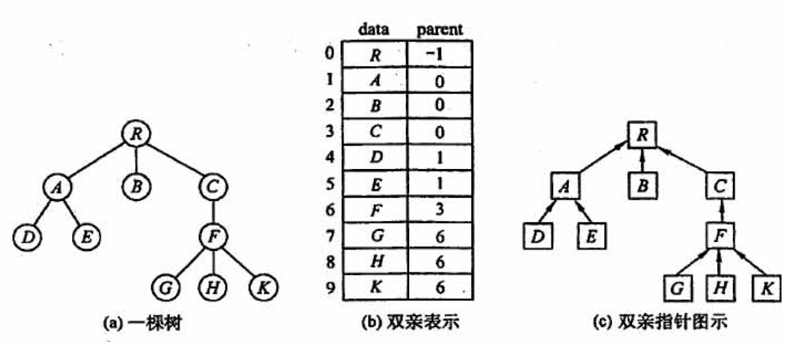

## 1 绪论/时间复杂度

### 1.1 存储结构
顺序存储、链式存储、索引存储和散列存储

### 1.2 时间复杂度

1. 关键的代码运算为 i = i * 2
设执行次数为t, 则, 2^t = n. ---> 其时间复杂度为log2n

2. `return n*fact(n-1)`
这是求N!的递归代码,每次调用`fact()`的参数会减1, 递归的出口为`fact(1)`一共执行了N次递归调用.

3. 链表合并
比较两个表中的元素,每比较一次,确定一个元素的链接位置(取最小元素,使用头插法),时间复杂度为: max(m,n)

4. 两层循环
一般看一下自变量,再决定是否是n^2


## 2 线性表
### 2.1 线性表的定义和基本操作
### 2.1.1  线性表的定义
线性表是具有相同数据类型的n (n≥0)个数据元素的<u>有限序列</u>，其中n为表长，当n= 0时线性表是一个空表。若用L命名线性表，则其一般表示为
L= (a1, a2, .. ai+1,...., an)

特点:
>表中元素的个数有限
>表中的元素具有逻辑上的顺序性,表中元素有其先后次序.
>表中元素都有数据元素, 每个元素都是单个元素.
>变种元素的数据类型都相同, 这意味着每个元素占有相同大小的储存空间.

注意 : 线性表是一种逻辑结构,表示元素自建一对一的相邻关系. 顺序表和链表是指存储结构, 两者属于不同层次的概念, 因此不要将其混淆.

#### 2.1.2 线性表的基本操作
```c
InitList (&L):初始化表。构造一个空的线性表。
Length(L):求表长。返回线性表L的长度，即L中数据元素的个数。
LocateElem(L,e):按值查找操作。在表L中查找具有给定关键字值的元素。
GetElem(L,i):按位查找操作。获取表L中第i个位置的元素的值。
ListInsert(&L,i,e):插入操作。在表L中的第i个位置上插入指定元素e。
ListDelete(&L,i,&e):删除操作。删除表L中第i个位置的元素，并用e返回删除元素
的值。
PrintList(L):输出操作。按前后顺序输出线性表L的所有元素值。
Empty(L):判空操作。若L为空表，则返回true，否则返回false。
DestroyList(&L):销毁操作。销毁线性表，并释放线性表L所占用的内存空间。
```
### 2.2 线性表的顺序表示
#### 2.2.1 循序表的定义

线性表的顺序存储--->顺序表.
是用一组地址连续的存储单元一次存储线性表中的数据元素,从而他们使两个元素在物理位置上相邻.
特点: 表中的元素的逻辑顺序与其物理顺序相同.


注意: 线性表中的元素的位序从1开始的,而数组中元素的下标是从0开始的

```c
#define MaxSize 50//定义线性表的最大长度
typedef struct {
	ElemType data [MaxSize] ;//顺序表的元素
	int length;//顺序表的当前长度
}SqList;//顺序表的类型定义

```
一维数组可以是静态分配的,也可以是动态分配的.
C 的初始动态分配语句为:`L.data = (ElemType *)malloc(sizeof(ElemType)*InitSize);`

#### 2.2.2 顺序表上的基本操作的实现
(1)插入操作
在顺序表L的第i (1<=i<=L.length+1)个位置插入新元素e。若i的输入不合法，则返回false,表示插入失败;否则，将第i个元素及其后的所有元素依次往后移动一个位置，腾出一个空位置插入新元素e,顺序表长度增加1,插入成功，返回true.
```c
bool ListInsert (SqList &L, int i, ElemType e) {
	if(i<1| li>L.length+1)//判断i的范围是否有效
		return false;	
	if (L. length>=MaxSize)//当前存储空间已满，不能插入
		return false;
	for (int j=L. length;j>=i;j--)//将第i个元素及之后的元素后移
		L.data[j]=L.data[j-1];
	L.data[i-1]=e; //在位置i处放入e
	L. length++;//线性表长度加1
	return true;
	}
	//最好情况O(1)
	//最坏情况O(N)
	//平均 n/2
```

(2)删除操作
删除顺序表L中第i (1<=i<=L.length)个位置的元素，用引用变量e返回。若i的输入不合法，则返回false;否则，将被删元素赋给引用变量e,并将第i+1个元素及其后的所有元素依次往前移动一个位置，返回true. 
共移动: n-i个
```c
bool ListDelete(SqList &L, int i, Elemtype &e) {
	if(i<1||i>L.length)  //判断I的范围是否有效
		return false;
	e=L.data[i-1]; 				//将呗删除的元素赋值给e 
	for(int j=i;j<L.length;j++) //将第I个位置后的元素前移
		L.data[j-1] = L.data[j]; 
	L.length--;  //线性表长度减1
	return ture;
	//最好情况O(1)
	//最坏情况O(N)
	//平均(n-1)/2
```


(3)按值查找(顺序查找)
在顺序表L中查找第一一个 元素值等于e的元素，并返回其位序。
```c
int LocateElem (SqList L, ElemType e){
	int i;
	for (i=0; i<L. length;i++)
		if(L.data[i]==e)
			return i+1;      //下标为i的元素值等于e,返回其位序i+1
		return 0;    //退出循环，说明查找失败
//最好情况O(1)
//最坏情况O(N)
//平均(n-1)/2
```

注意 :
>线性表的顺序存储结构是一种:随机存取的存储结构
>存取方式是指读写方式, 顺序表是一种支持随机存取的存储结构,根据起始地址加上元素的序号,可以方面的访问任意一个元素.

### 2.3 线性表的链式表示
####  2.3.1 单链表的定义
线性表的链式存储又称单链表.

```c
typedef struct LNode{
	ElemType data; //数据域
	struct Lnode *next; //指针域
}Lnode, *LinkList; 
//其中,Lnode * = Linklist

```
由于单链表的元素离散地分布在存储空间中,所以单链表是非随机存取的存储结构, 即不能直接找到表中某个特定的结点. 查找某个特定的结点时,需要从表头开始便利,依次查找.

带头节点的单链表, 头指针为NULL时表示一个空表. 头结点的指针域指向线性表的第一个元素结点


#### 2.3.2 单链表上基本操作的实现
1. 采用头插法建立单链表
该方法时从一个空表开始, 生成新结点, 并将读取到的数据存放到新结点的数据域中,然后将新结点插入到当前链表的表头,即头节点之后.


注意: 采用头插法建立单链表,读入数据的顺序与生成的链表中的元素的顺序是相反的, 每个结点插入的时间为0(1), 设单链表长为N, 则总时间复杂度为0(N)

2. 采用尾插法建立单链表
尾插法将新结点插入到当前链表的表尾,为此必须添加一个尾指针r, 使其始终指向当前链表的尾结点.


算法: 
```c
LinkList List_TailInsert(LinkList &L){
	int x;
	L=(LinkList)malloc(sizeof(LNode));
	LNode *s,*r=L; //r为表尾指针
	scanf("%d",&x); //输入结点的值
	while(x!=9999){
		s=(LNode *)malloc(sizeof(LNode));
		s->data = x;
		r->next=s;
		r=s;   //r指向新的表尾结点
		scanf("%d",&x);
	}
	r->next = NULL; //尾结点结点置空
	return L;
}
```

3. 按序号查找结点值
在单链表中从第一个结点出发,顺指针next 域逐个往下搜索,直到找到第i个结点为止,否则返回最后一个结点指针域NULL.

```c
LNode *GetElem(LinkList L, int i){
	int j=1; 
	LNode *p=L->next; //头结点指针赋给P
	if(i==0)
		return L; //若i等于0,则返回头结点
	if(i<1)
		return NULL; //若i无效,则返回NULL
	while(p&&j<i){
		//从第一个结点开始找, 查找第i个结点
		p=p->next;
		j++;
	}
	return p; //返回第i个结点的指针,若i大于表长,则返回NULL
}
```

4. 按值查找表结点
```c
LNode *LocateElem (LinkList L, ElemType e) {
	LNode *p=L- >next;
	while (p !=NULL&&p->data!=e) //从第一个结点开始查找data域为e的结点
	P=P- >next;
	return p;//找到后返回该结点指针，否则返回NULL
}

```

5. 插入结点操作
插入结点操作将值为X的新结点插入到单链表的第i个位置上, 先添加插入位置的合法性,然后找到待插入位置的前驱结点,即第i-1个结点,再在其后插入新结点.
首先调用按序号查找算法GetElem(L,i-1),查找第i-1个结点,假设返回的第i-1个结点为 * p,然后令新结点 * s的指针域指向 * p的后继结点, 再令结点 * p 的指针域指向新插入的结点 * s

实现插入结点核心代码:
```c
p=GetElem(L,i-1); //查找插入位置的前驱结点
s->next = p->next; 
p->next = s;
```
扩展:对某一结点进行前插操作
前插操作是指在某结点的前面插入一个新结点, 后插操作的定义刚好相反. 在单链表插入算法中, 经常使用后插操作.
前插操作可以找i-1个结点,然后进行后插操作.
此外，可采用另一种方式将其转化为后插操作来实现，设待插入结点为 * s,将 * s插入到 * p的前面。我们仍然将 * s插入到 * p的后面，然后将p->data与s->data交换，这样既满足了逻辑关系，又能使得时间复杂度为0(1)。算法的代码片段如下:

```c
s -> next = p->next; 
p->next=s;
temp=p->data;//交换数据域部分
p->data=s->data;
s->data=temp;
```

6. 删除结点操作
查找表中第i-1个结点,即被删结点的前驱结点,再将其删除
```c
p=GetElem(L,i-1); //查找删除位置的前驱结点
q=p->next; //令q指向被删除结点
p->next = q->next; //将*q结点从链中段考
free(q); //释放结点的存储空间
```
扩展:删除结点 * p。
要删除某个给定结点 * p,通常的做法是先从链表的头结点开始顺序找到其前驱结点，然后执行删除操作，算法的时间复杂度为O(n)。
其实，删除结点 * p的操作可用删除 * p的后继结点操作来实现，实质就是将其后继结点的值赋予其自身，然后删除后继结点，也能使得时间复杂度为0(1)。

```c
q=p->next;//令q指向*p的后继结点
P- >data=p->next->data ;//和后继结点交换数据域
P->next=q->next;//将*q结点从链中“断开”
free (q) ;//释放后继结点的存储空间
```

7. 求表长操作
设置一个计数器变量,每次访问一个结点,计数器加1

#### 2.3.3 双链表
双链表有两个指针, prior 和 next  分别指向前驱结点、后继结点


双链表描述:
```c
typedef struct DNode{
	ElemType data;  //数据域
	struct Dnode *prior,*next; //前驱和候机指针
}DNode, *DLinklist;
```
1. 双链表的插入操作


```c
s->next = p->next; //将结点*s插入到结点*p之后
p->next->prior=s;
s->prior=p;
p->next=s;
```

2. 双链表的删除操作


```c
p->next=q->next; //步骤1
q->next->prior=p; //步骤2
free(q);  

```

#### 2.3.4 循环链表
1. 循环单链表
循环单链表和单链表的区别在于,表中最后一个结点的指针不是NULL,而改为指向头结点,从而整个链表形成一个环.
再循环单链表中,表尾结点 * r的next域指向L, 表中没有指针域为NULL的结点,因此,循环单链表的判空条件不是头结点是否为空,**而是它是否等于头指针**


2. 循环双链表
在循环双链表中,某结点 * p 为尾结点时, `p->next==L` 当循环双链表为空表时,其头结点的`prior`域和`next`域都等于L.


#### 3.5 静态链表


## 第三章 栈和队列
### 3.1 栈
#### 3.1.1 栈基本概念


1. 定义
只能在一段进行操作的线性表.
特性: 后进先出

N个不同元素进栈.

2. 栈的基本操作
```c
InitStack(&S)//初始化一个空栈S。
StackEmpty(S)//判断一个栈是否为空，若栈s为空则返回true，否则返回false.
Push(&S,x)//进栈，若栈s未满，则将x加入使之成为新栈顶。
Pop(&S,&x)//出栈，若栈s非空，则弹出栈顶元素，并用x返回。
GetTop(s,&x)//读栈项元素，若栈s非空，则用x返回栈顶元素。
DestroyStack(&S)//销毁栈，并释放栈s占用的存储空间(“&” 表示引用调用)。
```

#### 3.1.2 栈的顺序存储结构
1. 顺序栈的实现.
采用顺序存储的栈叫顺序栈, 利用一组地址连续的存储单元存放自栈底到栈顶的数据元素, 同时附设一个指针(top)指示当前栈顶的位置.
栈的顺序存储类型
```c
#define MaxSize 50 
typedef struct{
	ElemType data[MaxSize]; 
	int top;
}SqStack;
```

栈顶指针: `s. top`,初始时设置`s. top=-1`; 栈顶元素: `s. data[S. top]`
进栈操作:栈不满时，栈顶指针先加1,再送值到栈顶元素。
出栈操作:栈非空时，先取栈项元素值，再将栈顶指针减1.
栈空条件:` s. top==-1`;栈满条件: `S. top==MaxSize-1`;栈长:` s.top+1`.

2. 顺序栈的基本运算


(1) 初始化
```c
void InitStack(SqStack &s){
	s.top=-1;//初始化指针5
}
```
(2)判栈空
```c
bool StackEmpty(SqStack S){
	if(S.top==-1)  //stack empty
		return true; 
	else 
		return false;
}
```
(3)进栈
```c
bool Push(SqStack &S,ElemType x){
	if(S.top == MaxSize-1)  //full stack, return error
		return false;
	S.data[++S.top] = x;  //指针先加1, 再入栈
	return true;
}
```
(4)出栈
```c
bool Pop(SqStack &S,ElemType &x){
	if(S.top==-1) //empty stack ,error
		return false;
	x=S.data[top--]; //先出栈,指针再减1
	return true;
}
```
(5)读栈顶元素
```c
bool GetTop(SqStack S,ElemType &x){
	if(S.top ==-1)
		return false;
	x = S.data[S.top];
	return true;
}

```

3. 共享栈

两个站的栈顶指针都指向栈顶元素, top0=-1时,0号栈为空, top1=MaxSize时,1号栈为空; 仅当两个站定指针相邻(top1-top0=1)时,判断为栈满.
当0号栈进栈时,top0先加1再赋值,1号栈进栈时,先减1再赋值; 出栈时刚好相反.

#### 3.1.3 栈的链式存储结构
链栈, 优点是便于多个栈共享存储空间和提高效率.
通常采用单链表实现, 并规定<u>所有操作都是在单链表的表头进行的</u>


```c
typedef struct Linknode{
	ElemType data;
	struct Linknode *next; 
}*LiStack;
```

### 3.2 队列
#### 3.2.1 队列的基本概念
1. 队列定义
只允许在表的一端进行插入,而在表的另一段进行删除.
最早排队的也是最早离队的, 特性: 先进先出


2. 队列常见的基本操作
```c
InitQueue (&Q)//初始化队列，构造-一个空队列Q。
QueueEmpty (Q)//判队列空，若队列Q为空返回true,否则返回false
EnQueue(&Q,x)//入队，若队列Q未满，将x加入，使之成为新的队尾
DeQueue (&Q, &x)//出队，若队列e非空，删除队头元素，并用x返回
GetHead(Q, &x)//读队头元素，若队列Q非空，则将队头元素赋值给X。

```
#### 3.2.2 队列的顺序存储结构
1. 队列的顺序存储
顺序实现:分配一块连续的存储单元存放队列中的元素,并附设两个指针: 队头指针`front`指向队头元素, 队尾指针`rear`指向队尾元素的下一个位置.

```c
	#define MaxSize 50
	typedef struct{
		ElemType data[MaxSize]; 
		int front, rear; //队头指针和队尾指针
	}SqQueue;
```
初始状态(队空条件): `Q. front==Q. rear==0`
进队操作:队不满时，<u>先送值到队尾元素，再将队尾指针加1</u>。
出队操作:队不空时，<u>先取队头元素值，再将队头指针加1</u>。

2. 循环队列
当队首指针 `Q.front = MaxSize-1`后,再前进一个位置就自动到0,这可以利用除法取余(%)来实现.
初始时:` Q. front=Q. rear=0`
队首指针迸1`Q. front= (Q. front+1) %MaxSize`
队尾指针进1:`Q. rear= (Q. rear+1) 8MaxSize`
队列长度: `(Q. rear+MaxSize-Q. front) 8MaxSize`

队空条件: `Q.front == Q.rear`
为了区别是队空开始队满,有三种处理方式:


3. 循环队列的操作
(1)初始化
```c
void InitQueue(SqQueue &Q){
	Q.rear=Q.front=0;  //初始化队首、队尾指针
}
```
(2)判队空
```c
bool isEmpty(SqQueue Q){
	if(Q.rear ==Q.front)
		return true; //队空条件
		else return false;
}
```
(3)入队
```c
bool EnQueue(SqQueue &Q,EeleType x){
	if((Q.rear+1)%MaxSize==Q.front)
		return false; //队满则报错
	Q.data[Q.rear] = x;
	Q.rear=(Q.rea+1)%MaxSize;//队尾指针加1取模
	return true;
}
```

(4)出队
```c
bool DeQueue(SqQueue &Q,ElemType &x){
	if(Q.rear == Q.front)
		return false; //队空报错
	x=Q.data[Q.front];
	Q.front = (Q.front+1)%MaxSize; //队头指针加1取模
	return true;
}
```

#### 3.2.3 队列的链式存储结构
1. 队列的链式存储

```c
typedef struct{
	ElemType data;
	struct LinkNode *next;
}LinkNode;
typedef struct{  //链式队列
	LinkNode *front,*rear; //队列的表头和队尾指针
}LinkQueue;
```
当`Q.front== NULL`且`Q.rear==NULL`时,链式队列为空.

带头结点的链式队列


2. 链式队列的基本操作
(1)初始化
```c
void InitQueue(LinkQueue &Q){
	Q.front=Q.rear =(LnikNode*)malloc(sizeof(LinkNode)); //建立头结点
	Q.front->next=NULL; //初始为空
}
```
(2)判队空
```c
bool IsEmpty(LinkQueue Q){
	if(Q.front==Q.rear)
		return true;
	else 
		return false;
}
```
(3)入队
```c
void EnQueue(LinkQueue &Q,ElemType x){
	LinkNode *s=(LinkNode *)malloc(sizeof(LinkNode));
	s->data=x;s->next=NULL; //创建新结点,插入到链尾
	Q.rear->next=s;
	Q.rear=s;
}
```
(4)出队
```c
bool DeQueue(LinkQueue &Q,ElemType &x){
	if(Q.front==Q.rear)
		return false; //空队
	LinkNode *p=Q.front->next;
	x=p->data;
	Q.front->next=p->next;
	if(Q.rear==p)
		Q.rear=Q.front; //若原队列只有一个结点, 删除后变空
	free(p);
	return true;
}
```

#### 3.2.4两端队列

允许在一端进行插入和删除,但在另一段只允许插入的两端队列称为:输出受限的两端队列.


### 3.3 栈和队列的应用
#### 3.3.1 栈在括号中的应用
括号成对抵消

#### 3.3.2 栈在表达式求值中的应用
1. 口诀
>后缀是符号进栈
>中缀是字母进栈
>栈顶元素比要进的(高或等于)就出.

2. 中缀、后缀表达式

中缀表达式:1+B * (C-D)-E/F
后缀表达式:ABCD- * +EF/-

3. 通过后缀表示计算表达式值的过程为:
顺序扫描表达式的每一项， 然后根据它的类型做如下相应操作:若该项是操作数，则将其压入栈中:若该项是操作符 < op > ,
则连续从栈中退出两个操作数Y和x,形成运算指令X < op > Y,并将计算结果重新压入栈中。当表达式的所有项都扫描并处理完后，栈顶存放的就是最后的计算结果。


4. 中缀转后缀方法
从左向右开始扫描中缀表达式, 遇到数字时,加入后缀表达式
遇到运算符:
>若为 ( 入栈
>若为 ) 则一次把战中的运算符加入后缀表达式,直到出现 ( , 从栈中删除 ( 
>若为除括号外的其他运算符, 当其优先级高于除( 外的栈顶运算符时, 直接入栈, 否则从栈顶开始, 依次弹出比当前处理的运算符优先级高和优先级相等的运算符, 直到一个比它优先级低的或遇到了一个左括号为止.

(1)  a+b - a * ( (c+d) /e-f) +g
首先需要根据操作符 < op > 的优先级来进行栈的变化. 我们用icp 来表示当前扫描到的运算符ch 的优先级,该运算符进站后的优先级为isp,则运算符的优先级如下表表示[isp]是栈内优先数,icp是栈外优先数


(2) 


## 第四章
### 4.1 串的定义和实现
#### 4.1.1 串的定义
串是由零个或多个字符组成的有限序列

#### 4.1.2 串的存储结构
1. 定长顺序存储表示
类似于线性表的顺序存储结构,用一组地址连续的存储单元存储串值的字符序列.
```c
#define MAXLEN 255
typedef struct{
	char ch[MAXLEN]; //每个分量
	int length; //串的实际长度
}
```
串长有两种表示方法: 
>1. 如上述一样,用额外的变量len来存放串的长度;
>2. 在串值后面加一个不计入串长的结束标记字符‘\0’, 此时的串长为隐含值.

2. 堆分配存储表示
堆分配存储表示依然以一组地址连续的存储单元存放串值的字符序列, 但他们的存储空间是在程序执行过程中动态分配得到的.
```c
typedef struct{
	char *ch;  //按串长分配存储区, ch指向串的基地址
	int length;   //串的长度
}HString;
```
堆的自由存储区,用malloc( )  和free( )函数来完成动态存储管理.

3. 块链存储表示
类似于线性表的链式存储结构, 也可采用链表方式存储串值.


#### 4.1.3 串的基本操作

● StrAss ign (&T, chars): 赋值操作。把串T赋值为chars。
● StrCopy(&T,S): 复制操作。由串s复制得到串T。
● StrEmpty(S):判空操作。若S为空串，则返回TRUE, 否则返回FALSE。
● StrCompare(S, T):比较操作。若S>T,则返回值>0;若S=T，则返回值=0;若S<T,
则返回值<0.
● strLength(S): 求串长。返回串s的元素个数。
● SubString (&Sub, s, pos, len):求子串。用Sub返回串s的第pos个字符起长度为
len的子串。
● Concat(&T,S1,S2):串联接。用T返回由S1和S2联接而成的新串。
● Index(S,T): 定位操作。若主串s中存在与串T值相同的子串，则返回它在主串s中
第一次出现的位置:否则函数值为0。
● ClearString(&S):清空操作。将s清为空串。
● DestroyString(&S): 销毁串。将串S销毁。

### 4.2 串的模式匹配
### 4.2.1 简单的模式匹配算法

子串的定位操作,求的是子串在主串中的位置. 采用定长顺序存储结构
```c
int Index(SString S,SString T){
	int i=1,j=1;
	while(i<S.length && j<=T.length){
		if(S.ch[i] == T.ch[j]){
			++i;++j; //继续比较后续字符
		}
		else{
			i = i-j+2;
			j=1;  //指针后退重新开始匹配
		}
	}
	if(j>T.length)
		return i-T.length;
	else return 0;
}

```

#### 4.2.2 改进的模式匹配算法-- KMP
1. 字符串的前缀、后缀和部分匹配值
2. KMP算法原理
主要就是计算Next数组的值
next[ j ]的含义是:在子串的第 j 个字符与主串发生失配时，则跳到子串的next[ j ]位置重新与主串当前位置进行比较。

例子:


## 第五章 树
### 5.1 树的基本概念
##### 5.1.1 树的定义

#### 5.1.2 基本术语


1) 度大于0的结点成为分支结点(又称非终端结点);度为0(没有子女结点)的结点称为叶子结点(又称终端结点). 在分支结点中, 每个结点的分枝数就是该结点的度.
2) 结点的深度、高度、层次
层度:从树根开始定义, 跟结点为第一层, 子结点为第二层.
深度:从根结点开始自顶向下逐层累加的
树的高度是树中结点的最大层数
3) 路径和路径长度
树中两个结点之间的路径是由这两个结点之间所经过的结点序列构成的.
路径长度是路径上所经过的边的个数.

#### 5.1.3 树的性质


## 5.2 二叉树的概念
### 5.2.1 二叉树的定义及其主要特性

1. 二叉树的定义
二叉树是N个结点的有限集合.


二叉树与度为2的有序树的区别:
>1. 度为2的树至少有3个结点, 而二叉树可以为空.
>2. 度为2的有序树的孩子的左右次序是相对于另一孩子而言的，若某个结点只有一个孩子,则这个孩子就无须区分其左右次序，而二叉树无论其孩子数是否为2,均需确定其左右次序。即二叉树的结点次序不是相对于另一结点而言，而是确定的。

2. 几个特殊的二叉树
(1)满二叉树
高度为h, 有2^h-1个结点的二叉树, 即树中的每层都含有最多的结点
满二叉树的叶子结点都集中在二叉树的最下一层,并且除叶子结点之外的每个结点度数都为2.
**双亲 为 [i/2] ,  左孩子 2i , 右孩子 2i+1**


(2)完全二叉树
高为h、有n个结点的二叉树, 当且仅当其每个结点都与高度为h的满二叉树中编号为1~n的结点一一对应.


>1. 若有度为1的结点，则只可能有一个，且该结点只有左孩子而无右孩子
>2. 按层序编号后，一旦出现某结点(编号为i)为叶子结点或只有左孩子，则编号大于i
的结点均为叶子结点。
>3. 若n为奇数，则每个分支结点都有左孩子和右孩子:若n为偶数，则编号最大的分支
结占(编号为n/2) 只有左孩子，没有右孩子，其余分支结点左、右孩子都有。
>4. 若i ≤ Ln/2」，则结点i为分支结点，否则为叶子结点。


(3)二叉排序树
左子树上所有结点的关键字均小于跟结点的关键字. 右子树上所有结点的关键字均大于根结点的关键字; 左子树和右子树又各是一棵二叉排序树.

(4)平衡二叉树
树上任一结点的左子树和右子树的深度之差不超过1.

3. 二叉树的性质


#### 5.2.2 二叉树的存储结构
1. 顺序存储结构
二叉树的顺序存储是用一组地址连续的存储单元依次自上而下、自左至右存储完全二叉树上的结点元素, 即 将完全二叉树上编号为i 的结点元素存储在一位数组下标为i-1的分量中.


2. 链式存储结构
用链表结点来存储二叉树中的每个结点. 


二叉树链式存储结构描述如下:
```c
typedef struct BiTNode{
	ElemType data;  //数据域
	struct BiTNode *lchild, *rchild;  //左右孩子指针
}BiTNode, * BiTree;
```
在n个结点的二叉链表中.含有 n+1个空链域.


### 5.3 二叉树的遍历和线索二叉树
#### 5.3.1 二叉树的遍历
1. 先序遍历
过程
>1)访问根结点
>2)先序遍历左子树
>3)先序遍历右子树

算法;
```c
void PerOrder(BiTree T){
	if(T!=NULL){
		visit(T);  //访问根结点
		PreOrder(T->lchild); //递归遍历左子树
		Preorder(T->rchild); //遍历右子树
	}
}
```

2. 中序遍历
过程
>1)先序遍历左子树
>2)访问根结点
>3)先序遍历右子树

算法;
```c
void PerOrder(BiTree T){
	if(T!=NULL){
		PreOrder(T->lchild); //递归遍历左子树
		visit(T);  //访问根结点
		Preorder(T->rchild); //遍历右子树
	}
}
```

3. 后序遍历
过程
>1)先序遍历左子树
>2)先序遍历右子树
>3)访问根结点

算法;
```c
void PerOrder(BiTree T){
	if(T!=NULL){
		PreOrder(T->lchild); //递归遍历左子树
		Preorder(T->rchild); //遍历右子树
		visit(T);  //访问根结点
	}
}
```

4. 递归算法和非递归算法的转换


```c
//中序遍历 非递归算法
void Inorder2(BiTree T){
	InisStack(S);
	BiTree p=T;
	while(p||!IsEmpty(S)){
		if(p){
			Push(S,p);
			p=p->lchild; //左孩子不空, 一直向左走
		}
		else{
			Pop(S,p);visit(p); //栈顶元素出栈, 访问出栈结点
			p=p->rchild;  // 向右子树走, p赋值为当前结点的右孩子
		}
	}
}

```

```c
//先序遍历 非递归算法
void Inorder2(BiTree T){
	InisStack(S);
	BiTree p=T;
	while(p||!IsEmpty(S)){
		if(p){
			visit(p);  //访问结点
			Push(S,p);   //先入栈
			p=p->lchild; //左孩子不空, 一直向左走
		}
		else{
			Pop(S,p); //栈顶元素出栈
			p=p->rchild;  // 向右子树走, p赋值为当前结点的右孩子
		}
	}
}

```

5. 层次遍历

```c
void LevelOrder(BiTree T){
	InitQueue(Q); 
	BiTree p;
	EnQueue(Q,T);  //将根结点入队
	while(!IsEmpty(Q)){
		DeQueue(Q,p);   //队头结点出队
		visit(p);  //访问出队结点
		if(p->lchild!=NULL)
			EnQueue(Q,p->lchild); //左子树不空, 则左子树根结点入队
		if(p->rchild!=NULL)
			EnQueue(Q,p->rchild); //右子树不空,则右子树根结点入队
	}
}
```

6. 由遍历序列构造二叉树
1)由二叉树的先序序列和中序序列可以唯一地确定一棵二叉树
>在先序遍历序列中,第一个结点一定是二叉树的根结点;
>在中序遍历中,根结点必然将中序遍历分割成两个字序列, 前一个字序列是根结点左子树的中序序列, 后一字序是根结点右子树的中序序列.

2)后序序列和中序序列可以唯一确定一棵二叉树
>后续序列的最后一个结点就如同先序序列的第一个结点, 可以将中序序列分割成两个序列

#### 5.3.2 线索二叉树
1. 线索二叉树的基本概念
遍历二叉树是以一定的规则将二叉树中的结点排列成一个线性序列，从而得到几种遍历序列，使得该序列中的每个结点(第一个和最后一个结点除外)都有一个直接前驱和直接后继。
在含N个结点的二叉树中, 有N+1个空指针. 


存储结构
```c
typedef struct ThreadNode{
	ElemType data; //数据元素
	struct ThreadNode *lchild, *rchild; //左右孩子指针
	int ltag,rtag; //左右线索标志
}ThreadNode, *ThreadTree;

```

2. 中序线索二叉树的构造
二叉树的线索化是将二叉链表中的空指针改为指向前驱或后继的线索. 而前驱或后继的信息只有在遍历时才能得到, 因此线索化的实质就是遍历一次二叉树.
指针pre指向刚刚访问过的结点,指针p指向正在访问的结点,即pre指向p的前驱. 在中序遍历的过程中,检查p的左指针是否为空, 若为空就将它指向pre, 检查pre的右指针是否为空, 若为空就将它指向p

算法:
```c
//通过中序遍历对二叉树线索化的递归算法如下:
void InThread(ThreadTree &p,ThreadTree &pre){
	if(p!=NULL){
		InThread(p->lchild,pre); //递归,线索化左子树
		if(p->lchild=NULL){ //左子树为空, 建立前驱线索
			p->lchild =pre;
			p->ltag=1;
		}
		if(pre!=NULL &&pre->rchild==NULL){
			pre->rchild=p; //建立前驱结点的后继线索
			pre->rtag=1;
		}
		pre=p;  //标记当前结点成为刚刚访问过的结点
		InThread(p->rchild,pre); //递归, 线索化右子树 
	}  //if(p!=NULL)
}

//通过中序遍历建立中序线索二叉树的主过程算法
void CreateInThread(ThreadTree T){
	ThreadTree pre = NULL;
	if(T!=NULL){    //非空二叉树,线索化
		InThread(T,pre); //线索化二叉树
		pre->rchild = NULL;  //处理遍历的最后结点
		pre->rtag = 1;
	}
}
```

3. 中序线索二叉树的遍历
中序线索二叉树的结点隐含了线索二叉树的前驱和后继的信息, 在对其进行遍历时, 只要先找到序列中的第一个结点,然后依次找结点的后继, 直至其后继为空.
在中序线索二叉树中找结点后继的规律是: 若其有标志为1, 则右链为线索,指示其后继,否则遍历右子树中第一个访问的结点(右子树中最左下的结点)为其后继.
1)求中序线索二叉树中中序序列下的第一个结点
```c
ThreadNode *Firstnode(ThreadNode *p){
	while(p->ltag==0)
		p=p->lchild; //最左下结点(不一定是叶结点)
		return p;
}

```

2)求中序线索二叉树中结点p在中序序列下的后继

```c
ThreadNode *Nextnode(ThreadNode *p){
	if(p->ltag==0)
		return Firstnode(p->rchild);
	else 
		return p->rchild;  //rtag ==1 直接返回后继线索
}

```

3)利用上面的算法,可以写出不含头结点的中序线索二叉树的中序遍历的算法:
```c
void Inorder(ThreadNOde *T){
	for(ThreadNode *p=Firstnode(T);p!=NULL;p=Nextnode(p))
		visit(p);
}
```
4. 先序线索二叉树和后续线索二叉树


### 5.4 树、森林
#### 5.4.1 树的存储结构
1. 双亲表示法


```c
#define MAX_TREE_SIZE 100 //树中最多结点数
typedef struct{
	ElemType data; 
	int parent; //双亲位置域
}PTNode;
typedef struct{
	PTNode nodes[MAX_TREE_SIZE]; //双亲表示
	int n;
}PTree;
```
注意:区别树的顺序存储结构与二叉树的顺序存储结构。在树的顺序存储结构中，数组下标
代表结点的编号，下标中所存的内容指示了结点之间的关系。而在二叉树的顺序存储结构中，数组下标既代表了结点的编号，又指示了二叉树中各结点之间的关系。当然，二叉树属于树，因此二叉树都可以用树的存储结构来存储，但树却不都能用二叉树的存储结构来存储。

2. 孩子兄弟表示法
又称二叉树表示法, 孩子兄弟表示法使每个结点包含三个部分内容: 结点值、指向结点第一个孩子结点的指针, 及指向结点下一个兄弟结点的指针.
```c
typedef struct CSNode{
	ElemType data; //数据域
	struct CSNode *firstchild,*nextsibling; //第一个孩子和右兄弟指针
}CSNode,*CSTree;
```


#### 5.4.2 树、森林与二叉树的转换
树转换为二叉树的规则:每个结点左指针指向它的第一个孩子， 右指针指向它在树中的相邻
右兄弟,这个规则又称“左孩子右兄弟”。由于根结点没有兄弟，所以对应的二叉树没有右子树.


#### 5.4.3 树和森林的便利
先根遍历 ---- 二叉树的先序遍历
后根遍历---二叉树的中序遍历


### 5.5 树与二叉树的应用
#### 5.5.1 二叉排序树(BST)
1. 二叉排序树的定义

2. 二叉排序树的查找


3. 二叉排序树的插入
4. 二叉排序树的构造
5. 二叉排序树的删除
6. 二叉排序树的查找效率分析

#### 5.5.2 平衡二叉树


## 第六章 图
### 6.1 图的基本概念
#### 6.1.1 图的定义

图G由顶点集V和边集E组成，记为G=(V,E)，其中V(G)表示图G中顶点的有限非空集;E(G)表示图G中顶点之间的关系(边)集合。若V= {V1, v2,......., vn}, 则用|V|表示图G中顶点的个数,E={(u,v)|u∈V, v∈V }，用|E|表示图G中边的条数。

1. 有向图

若E是有向边(也称弧)的有限集合时，则图G为有向图。弧是顶点的有序对，记为<v, w>, 其中v.w是顶点，v称为弧尾，w称为弧头，<y,w>称为从v到w的弧，也称v邻接到w。

2. 无向图

若E是无向边(简称边)的有限集合时，则图G为无向图。边是顶点的无序对，记为(v, w)或(w,)。可以说w和v互为邻接点。边(v, w依附于w和v,或称边(v, w)和v, w相关联。

3. 简单图、多重图

一个图G如果满足:①不存在重复边:②不存在顶点到自身的边，那么称图G为简单图。
若图G中某两个顶点之间的边数大于1条，又允许顶点通过一条边和自身关联，则称图G为多重图。多重图和简单图的定义是相对的。数据结构中仅讨论简单图。

4. 完全图(也称筒单完全图)

对于无向图，|E|的取值范围为0到n(n -1)/2，有n(n - 1)/2条边的无向图称为完全图，在完全图中任意两个顶点之间都存在边。对于有向图，|E|的取值范围为0到n(n -1),有n(n -1)条弧的有向图称为有向完全图，在有向完全图中任意两个顶点之间都存在方向相反的两条弧。

5. 子图

设有两个图G=(V, E)和G'=(V',E'),若V是V的子集，且E'是E的子集，则称G'是G的
子图。若有满足V(G')= V(G)的子图G',则称其为G的生成子图。图6.1中G3为G的子图。

6. 连通、连通围和连通分量
在无向图中，若从顶点v到顶点w有路径存在，则称v和w是连通的。若图G中任意两个顶点都是连通的，则称图G为连通图，否则称为非连通图。无向图中的极大连通子图称为连通分
量.
非连通情况下边最多的情况, 由N-1个顶点构成一个完全图, 此时再任意加入一条边则变成连通图.


7. 强连通图、强连通分量
在有向图中，如果有一对顶点 v和w，从v到w和从w到v之间都有路径，则称这两个顶点
是强连通的。若图中任何一对顶点都是强连通的，则称此图为强连通图。有向图中的极大强连通子图称为有向图的强连通分量，
注意:在无向图中讨论连通性，在有向图中讨论强连通性。
有向图强连通情况下边最少的情况; 至少需要N条边,构成一个环路.

8. 生成树、生成森林
连通图的生成树是包含图中全部项点的一个极小连通子图。若图中顶点数为n,则它的生成
树含有n-1条边。包含图中全部顶点的极小连通子图，只有生成树满足这个极小条件,对生成树而言，若砍去它的一条边， 则会变成非连通图，若加上一条边则会形成一个回路。在非连通图中，连通分量的生成树构成了非连通图的生成森林。
注意: 区分极大连通子图和极小连通子图,极大连通子图是无向图的连通分量, 极大即要求该连通子图包含其所有的边; 极小连通子图是既要保持图连通又要使得边数最小的子图.  


9. 顶点的度、入度和出度
在无向图中，顶点v的度是指依附于顶点v的边的条数，记为TD(v).
无向图的全部顶点的度的和等于边数的两倍, 因为每条边和两个顶点相关联.
有向图的全部顶点的入度之和与出度之和相等,并且等于边数, 因为每条有向边都有一个起点和终点.

10. 边的权和网
在一个图中，每条边都可以标上具有某种含义的数值，该数值称为该边的权值。这种边上带
有权值的图称为带权图，也称网。

11. 稠密图、稀疏图
边数很少的图称为稀疏图，反之称为稠密图。稀疏和稠密本身是模糊的概念，稀疏图和稠密
图常常是相对而言的。一般当图G满足|E|< |V|log|V|时，可以将G视为稀疏图。

12. 路径、路径长度和回路
顶点vp到顶点vq之间的一条路径是指顶点序列vp , vi1 , vi2 , ..,vlm ,Vq，
当然关联的边也可理解为路径的构成要素。路径上边的数目称为路径长度。第一个顶点和最后一个顶点相同的路径称为回路或环。若一个图有n个顶点，并且有大于n-1条边，则此图一定有环。

13. 简单路径、筒单回路
在路径序列中，顶点不重复出现的路径称为简单路径。除第一个顶点和最后一个顶点外，其
余顶点不重复出现的回路称为简单回路。

14. 距离
从顶点u出发到顶点v的最短路径若存在，则此路径的长度称为从u到v的距离。若从u到
v根本不存在路径，则记该距离为无穷(∞)。

15. 有向树
一个顶点的入度为0、其余顶点的入度均为1的有向图，称为有向树。

### 6.2图的存储及基本操作
#### 6.2.1 领接矩阵法

用一个一位数组存储图中顶点的信息,用一个二维数组存储图中边的信息(即各顶点之间的邻接关系),存储顶点之间邻接关系的二维数组称为邻接矩阵.


```c
//定义
#define MaxVertexNum 100   //顶点数目的最大值
typedef char VertexType;   //顶点的数据类型
typedefe int EdgeType;    //带权图中边上权值的数据类型
typedef struct{
	VertexType Vex[MaxVertexNum];  //顶点表
	EdgeType Edge[MaxVertexNum][MaxVertexNum];  //临界矩阵 ,边表
	int vexnum,arcnum;   //图的当前顶点数和 弧数
}MGraph;
```


#### 6.2.2 领接表法

当一个图为稀疏图时，使用邻接矩阵法显然要浪费大量的存储空间，而图的邻接表法结合了顺序存储和链式存储方法，大大减少了这种不必要的浪费。
所谓邻接表，是指对图G中的每个顶点vi建立一个 单链表，第i个单链表中的结点表示依附于顶点vi的边(对于有向图则是以顶点vi为尾的弧)，这个单链表就称为顶点vi的边表(对于有向图则称为出边表)。边表的头指针和顶点的数据信息采用顺序存储(称为顶点表),所以在邻接表中存在两种结点:顶点表结点和边表结点

顶点表结点由顶点域(data)和指向第一条邻接边的指针(firstarc) 构成，边表(邻接表)结点由邻接点域(adjvex) 和指向下一条邻接边的指针域(nextarc) 构成。

无向图邻接表


有向图邻接表


特点: 
> 1. 若G为无向图，则所需的存储空间为O(|V|+ 2|E|);若G为有向图,则所需的存储空间为O(|V|+|E|)

#### 6.2.3 十字链表
十字链表是有向图的一种链式存储结构. 对应于有向图中每条弧有一个结点,对应于每个顶点也有一个结点


#### 6.2.4 邻接多重表


#### 6.2.5 图的基本操作

```c
Adjacent (G,x,y): 判断图G是否存在边<x, y>或(x, y)。

Neighbors (G,x):列出图G中与结点x邻接的边。

InsertVertex (G,x): 在图G中插入顶点x。

DeleteVertex(G,x): 从图G中删除顶点x。

AddEdge (G,X, y):若无向边(x, y)或有向边<x, y>不存在，则向图G中添加该边。

RemoveEdge (G, x,y): 若无向边(x, y)或有向边<x, y>存在，则从图G中删除该边。

FirstNeighbor(G,x):求图G中顶点x的第一个邻接点，若有则返回顶点号。若x没有邻接点或图中不存在x，则返回-1

NextNeighbor(G,x,y):假设图G中顶点y是顶点x的一一个邻接点，返回除y外顶点x的下一个邻接点的顶点号，若y是x的最后一一个邻接点，则返回-1。

Get_edge_value(G, x,y): 获取图G中边(x, y)或<x, y>对应的权值。家园

set_edge_value(G,x,y,v):设置图G中边(x, y)或<x, y>对应的权值为v。

```

### 6.3 图的遍历
#### 6.3.1 广度优先搜索
广度优先搜索类似于二叉树的层序遍历算法. 基本思想是先访问起始顶点V, 接着由V出发,依次访问V的各个为访问过的邻接顶点W1,W2...然后依次访问W1,W2,....的所有未被访问的邻接顶点;再从这些访问过的顶点出发, 访问他们所有未被访问过的邻接顶点, 直至图中所有顶点都被访问过为止.若此时图中尚有顶点未被访问,则另选图中一个未曾被访问的顶点作为始点,重复上述过程.直到图中所有顶点都被访问到为止.
换句话说，广度优先搜索遍历图的过程是以v为起始点，由近至远依次访问和v有路径相通且路径长度为1, 2, .的顶点。广度优先搜索是一种分层的查找过程，每向前走一步可能访问一批顶点，不像深度优先搜索那样有往回退的情况，因此它不是一一个递归的算法。为了实现逐层的访问，算法必须借助一个辅助队列，以记忆正在访问的顶点的下一层顶点。

代码: 
```c
bool visited[MAX_VERTEX_NUM]; //访问标记数组
void BFSTraverse(Graph G){    //对图 G进行广度优先遍历
for (i=0; i<G.vexnum; ++i)
	visited[i]=FALSE; //访间标记数组初始化
InitQueue(Q);		//初始化辅助队列Q 
for(i=0;i<G,vexnum;++i)   //从0号顶点开始遍历
	if(!visited[i])   //对每个连通分且调用一次BFS
	BFS(G,i);    //vi未访问过，从vi开始BFS 
}
void BFS (Graph G,int v){   //从顶点v出发，广度优先遍历图G
	visit(v);  //访问初始顶点v
	visited[v]=TRUE;  //对v做已访问标记
	Enqueue(Q,v);   //顶点v入队列Q
	while(isEmpty(Q)){
		DeQueue(Q,v);   //顶点V出队列
   for(w=FirstNeighbor(G,v);w>=0;w=NextNeighbor(G,v,w))   //检测V所有邻接点
   if(!visited[w]){   //W为V的尚未访问邻接顶点
   visit(w);    //访问顶点W
   visited[w] = TRUE;    // 对W做已访问标记
   EnQueue(Q,w)     //顶点W入队列   
  	}  //if
	} //while
}
```


1. 性能分析
需要一个辅助队列Q, N个顶点均入队一次,在最坏的情况下,空间复杂度为O(|V|)

采用邻接表存储方式时，每个顶点均需搜索一次(或入队一次)，故时间复杂度0(|V|)，在搜索任顶点的邻接点时，每条边至少访问一次，故时间复杂度为0(|E|), 算法总的时间复杂度为0(|V|+ |E|)。采用邻接矩阵存储方式时，查找每个顶点的邻接点所需的时间为o(|V|),故算法总的时间复杂度为0(|V|^2)。

2. BFS算法求解单源最短路径问题

若图G=(V,E)为非带权图,定义从顶点u到顶点v的最短路径d(u,v)为从u到v的任何路径
中最少的边数;若从u到v没有通路，则d(u,v)=∞。
使用BPS,我们可以求解一一个满足 上述定义的非带权图的单源最短路径问题，这是由广度优先搜索总是按照距离由近到远来遍历图中每个顶点的性质决定的。
算法:

```c
void BFS_MIN_Distance(Graph G,int u){
//d[i]表示从U到i节点的最短路径
for (i=0;i<G.vexnum;++i)
	d[i] = ∞;
visited[i] = TRUE, d[u]=0;
EnQueue(Q,u);
while(!isEmpty(Q)){  
	DeQueue(Q,u);  //队头元素入队
	for(w=FirstNeighhor(G,u);w>=0;w=NextNeighbor(G,u,w))
		if(!visited[w]){   //w为u的尚未访问的邻接结点
			visited[w]=TRUE;   //设已访问标记
			d[w]=d[u]+1;   //路径长度加1
			EnQueue(Q,w);   //顶点W入队
		}//if
	}//while
}

```


3. 广度优先生成树
给定图的邻接矩阵存储表示是唯一的,所以其广度优先生成树也是唯一的,但由于邻接表存储表示不唯一,所以广度优先生成树也不是唯一的.


#### 6.3.2 深度优先搜索
深度优先搜索类似于树的先序遍历

它的基本思想如下:首先访问图中某一起始顶点V,.然后由v出发，访问与v邻接且未被访
问的任一顶点w1,再访问与w1邻接且未被访问的任一顶点.....重复上述过程。当不能再继续向下访问时，依次退回到最近被访问的顶点，若它还有邻接顶点未被访问过，则从该点开始继续上述搜索过程，直至图中所有顶点均被访问过为止。

算法: 

```c
bool visited[MAX_VERTEX_NUM]; //访问标记数组
void DFSTraverse(Graph G){   //对图G进行深度优先遍历
	for(v=0;v<G.vexnum; ++v)
		visited[v]=FALSE;  //初始化已经访问标记数据
	for(v=0;v<G.vexnum;++v)  //从V=0开始遍历
		if(!visited[v])
			DFS(G,v); 
}

void DFS(Graph G,int v){   //从顶点V出发,深度优先遍历图G
	visit(v);   //访问顶点V
	visited[v]=TRUE;   //设已经访问标记
	for(w=FistNeighbor(G,v);w>=0;w=NextNeighbor(G,v,w))
		if(!visited[w]){  //W为V的尚未访问的邻接顶点
		DFS(G,w);
		}//if
}

```
1. 性能分析
是个递归算法,空间复杂度为0(|V|)
遍历图的过程实质上是对每个顶点查找其邻接点的过程，其耗费的时间取决于所用的存储结构。以邻接矩阵表示时,查找每个顶点的邻接点所需的时间为0(|V|), 故总的时间复杂度为0(|V^2|)。以邻接表表示时，查找所有顶点的邻接点所需的时间为0(|E|),访问顶点所需的时间为0(|V|), 此时，总的时间复杂度为O(|V| + |E|)。

2. 深度优先的生成树和生成森林


#### 6.3.3 图的遍历与图的连通性
图的遍历算法可以用来判断图的连通性


### 6.4 图的应用
#### 6.4.1 最小生成树
一个连通图的生成树包含图的所有顶点，并且只含尽可能少的边。对于生成树来说，若砍去它的一条边，则会使生成树变成非连通图;若给它增加一条边，则会形成图中的一条回路。
1. 性质
1) 最小生成树不是唯一的. 当图G中的各边权值户部巷等你时,G的最小生成树是唯一的;若无相连通图G的边数比顶点数少1, 即G本身是一棵树时, 则G的最小生成树就是他本身.
2) 最小生成树的边的权值之和总是唯一的， 虽然最小生成树不唯一，但其对应的边的权值之和总是唯一的，而且是最小的。
3) 最小生成树的边数为顶点数减1.

2. Prim算法

Prim普里姆算法类似于寻找图的最短路径的Dijkstra算法
初始时,从图中任取一顶点加入树T,此时树中只含有一个顶点, 之后选择一个与当前T中顶点集合距离最近的顶点, 并将该顶点和对应的边加入T, 每次操作后T中的顶点数和边数都增1. 得到T就是最小生成树, T中必然有N-1条边


3. Kruskal算法
是一种按权值的递增次序选择合适的边来构建最小生成树的方法.
Kruskal算法构造最小生成树的过程. 初始时为只有n个顶点而尤边的非连通图T= {V, {}}, 每个顶点自成一个连通分量，然后按照边的权值由小到大的顺序，不断选取当前未被选取过且权值最小的边，若该边依附的顶点落在T中不同的连通分量上，则将此边加入T.否则舍弃此边而选择下一条权值最小的边。以此类推，直至T中所有顶点都在一个连通分量上。


#### 6.4.2 最短路径

1. Dijkstra算法求单元最短路径问题
设置一个集合S记录已求得的最短路径的顶点,初始时把源点V0放入S, 集合S每并入一个新顶点Vi , 都要修改源点V0到集合V-S中顶点当前的最短路径长度值

设置两个辅助数组
dist[ ]:记录从源点Vo到其他各顶点当前的最短路径长度，它的初态为:若从vo到vi;有弧，则dist[i]为弧上的权值:否则置dist[i]为∞。
path[ ]: path[i]表示从源点到顶点i之间的最短路径的前驱结点。在算法结束时可根据其值追溯得到源点vo到顶点vi的最短路径。


#### 6.4.3 有向无环图表述表达式

#### 6.4.4 拓扑排序
AOV网:若用DAG图表示一个工程,其顶点表示活动, 用有向边<vi,vj>表示vi必须先于活动vj进行的这样的一种关系.


```c
bool Topotogica1sort(Graph G){
	Tnitstack(s);	 //初始化栈，存储入度为0的顶点
	for(int i=0;i<G.vexnum ;i++)
		if(indegreee[i]==0)
		Push(S,i);   //将所有入度为0 的顶点进栈
	int count=0;   //计数，记录当前已经输出的顶点数
	while (!IsEmpty(S)){  	//栈不空，则存在入度为0的顶点
	Pop(S.i);//栈顶元察出栈
	print[count++]=i 	//输出顶点i
	for(p=G.vertices[i].firstarc;p;p=p->nextarc){ //将所有i指向的顶点的入度减1,并且将入度减为0的项点压入栈S
		v=p->adjvex;
		if(!(--indegree[v]))
		Push(S,v); //入度为0，则入栈
		}
} //while
if(count<G.vexnum)
	return false; //排序失败，有向图中有回路
else
	return true;//拓扑排序成功
}
```

由于输出每个顶点的同时还要删除以它为起点的边，故拓扑排序的时间复杂度为o(|V| + |E|)。
对一个AOV网，如果采用下列步骤进行排序，则称之为逆拓扑排序:
①从AOV网中选择一个没有后继(出度为0)的顶点并输出。
②从网中删除该顶点和所有以它为终点的有向边。
③重复①和②直到当前的AOV网为空。
用拓扑排序算法处理AOV网时，应注意以下问题:
①入度为零的顶点，即没有前驱活动的或前驱活动都已经完成的顶点，工程可以从这个顶点所代表的活动开始或继续。
②若一个顶点有多个直接后继，则拓扑排序的结果通常不唯一;但若各个顶点已经排在一个线性有序的序列中，每个顶点有唯一的前驱后继关系，则拓扑排序的结果是唯一的。
③由于AOV网中各顶点的地位平等，每个顶点编号是人为的，因此可以按拓扑排序的结果重新编号，生成AOV网的新的邻接存储矩阵，这种邻接矩阵可以是三角矩阵;但对于一
般的图来说，若其邻接矩阵是三角矩阵，则存在拓扑序列;反之则不一定成立。


#### 6.4.5 关键路径
在带权有向图中,以顶点表示事件,以有向边表示活动,以边上的权值表示完成该活动的开销. 称之为用边表示活动的网络,简称AOE网.
AOV网无权值. AOE网有权值
性质: 
①只有在某顶点所代表的事件发生后，从该顶点出发的各有向边所代表的活动才能开始;
②只有在进入某顶点的各有向边所代表的活动都已结束时,该顶点所代表的事件才能发生。

1. 事件vk的最早发生时间ve(k)
它是指从源点v1到顶点Vk的最长路径长度。事件Vk的最早发生时间决定了所有从Vk开始的活动能够开工的最早时间。可用下面的递推公式来计算:
ve(源点)=0
ve(k) = Max{ve(j) + Weight(Vj, vk}, Vk为vj的任意后继，Weight (vj, vk)表示<Vj, vk>上的权值

计算ve()值时，按从前往后的顺序进行，可以在拓扑排序的基础上计算:
①初始时，令ve[1..n] = 0.
②输出一个入度为0的顶点vj时，计算它所有直接后继顶点vk的最早发生时间，若ve[j] +
Weight(vj,vk)> ve[k],则ve[k]= ve[j] + Weight(vj, vk)。以此类推，直至输出全部顶点。

2. 事件以的最迟发生时间vl(k)
它是指在不推迟整个工程完成的前提下，即保证它的后继事件vj,在其最迟发生时间vl(j)能够发生时，该事件最迟必须发生的时间。可用下面的递推公式来计算:
vl(汇点) = ve(汇点)
vl(k) = Min{vl(j) - Weight(vk, vj)}, ve为vj 的任意前驱
注意:在计算vl(k)时，按从后往前的顺序进行，可以在逆拓扑排序的基础上计算。
计算vl(0)值时，按从后往前的顺序进行，在上述拓扑排序中，增设一个栈以记录拓扑序列，拓扑排序结束后从栈顶至栈底便为逆拓扑有序序列。过程如下:
①初始时，令vl[1..n] = ve[n].
②栈顶顶点vj出栈，计算其所有直接前驱顶点vk的最迟发生时间，若vl[j] - Weight(vk,vj) <vl[k],则vI[k] = vl[f]] - Weight(vk, vj)。以此类推，直至输出全部栈中顶点。

3. 活动aj的最早开始时间e(i)
它是指该活动弧的起点所表示的事件的最早发生时间。若边<vk, vj>表示活动ai,则有e(i) = ve(k)。

4. 活动a的最迟开始时间l(i)
它是指该活动弧的终点所表示事件的最迟发生时间与该活动所需时间之差。若边<vk, vj>表示活动ai,则有l(i)= v(j) - Weight(vk,vj)

5. 一个活动ai的最迟开始时间l(i)和其最早开始时间e(i)的差额d(i)=l(i)-e(i)
它是指该活动完成的时间余量，即在不增加完成整个工程所需总时间的情况下，活动ai可以拖延的时间,若一个活动的时间余量为零,则说明该活动必须要如期完成,否则会拖延整个工程进度.所以称l(i)- e(i)= 0即l(i) = e(i)的活动ai 是关键活动。


## 第七章 查找
### 7.1 查找的基本概念

### 7.2 顺序查找和折半查找
#### 7.2.1 顺序查找

1. 一般线性表的顺序查找
引入哨兵,会让循环不必判断数组越界

2. 有序表的顺序查找

#### 7.2.2 折半查找

折半查找的基本思想:
首先将给定值key与表中中间位置的元素比较,若相等,则查找成功，返回该元素的存储位置;若不等，则所需查找的元素只能在中间元素以外的前半部分或后半部分(例如，在查找表升序排列时，若给定值key大于中间元素,则所查找的元素只可能在后半部分)。然后在缩小的范围内继续进行同样的查找，如此重复，直到找到为止，或确定表中没有所需要查找的元素，则查找不成功，返回查找失败的信息。算法如下:
```c
int Binary_Search(SeqList L,ElemType key){
	int low=0,high=L.TablenLen-1,mid;
	while(low<=high){
		mid=(low+high)/2;   //取中间位置
		if(L.elem[mid]==key)
			return mid;   //查找成功则返回所在位置
		else if(L.elem[mid]>key)
			high=mid-1;  //从前半部分继续查找
		else
			low=mid+1;  //从后半部分继续查找
	}
	return -1;   //查找失败,返回-1
}

```


 
