## 1 绪论/时间复杂度

### 1.1 存储结构
顺序存储、链式存储、索引存储和散列存储

### 1.2 时间复杂度
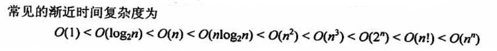
1. 关键的代码运算为 i = i * 2
设执行次数为t, 则, 2^t = n. ---> 其时间复杂度为log2n

2. `return n*fact(n-1)`
这是求N!的递归代码,每次调用`fact()`的参数会减1, 递归的出口为`fact(1)`一共执行了N次递归调用.

3. 链表合并
比较两个表中的元素,每比较一次,确定一个元素的链接位置(取最小元素,使用头插法),时间复杂度为: max(m,n)

4. 两层循环
一般看一下自变量,再决定是否是n^2


## 2 线性表
### 2.1 线性表的定义和基本操作
### 2.1.1  线性表的定义
线性表是具有相同数据类型的n (n≥0)个数据元素的<u>有限序列</u>，其中n为表长，当n= 0时线性表是一个空表。若用L命名线性表，则其一般表示为
L= (a1, a2, .. ai+1,...., an)

特点:
>表中元素的个数有限
>表中的元素具有逻辑上的顺序性,表中元素有其先后次序.
>表中元素都有数据元素, 每个元素都是单个元素.
>变种元素的数据类型都相同, 这意味着每个元素占有相同大小的储存空间.

注意 : 线性表是一种逻辑结构,表示元素自建一对一的相邻关系. 顺序表和链表是指存储结构, 两者属于不同层次的概念, 因此不要将其混淆.

#### 2.1.2 线性表的基本操作
```c
InitList (&L):初始化表。构造一个空的线性表。
Length(L):求表长。返回线性表L的长度，即L中数据元素的个数。
LocateElem(L,e):按值查找操作。在表L中查找具有给定关键字值的元素。
GetElem(L,i):按位查找操作。获取表L中第i个位置的元素的值。
ListInsert(&L,i,e):插入操作。在表L中的第i个位置上插入指定元素e。
ListDelete(&L,i,&e):删除操作。删除表L中第i个位置的元素，并用e返回删除元素
的值。
PrintList(L):输出操作。按前后顺序输出线性表L的所有元素值。
Empty(L):判空操作。若L为空表，则返回true，否则返回false。
DestroyList(&L):销毁操作。销毁线性表，并释放线性表L所占用的内存空间。
```
### 2.2 线性表的顺序表示
#### 2.2.1 循序表的定义

线性表的顺序存储--->顺序表.
是用一组地址连续的存储单元一次存储线性表中的数据元素,从而他们使两个元素在物理位置上相邻.
特点: 表中的元素的逻辑顺序与其物理顺序相同.
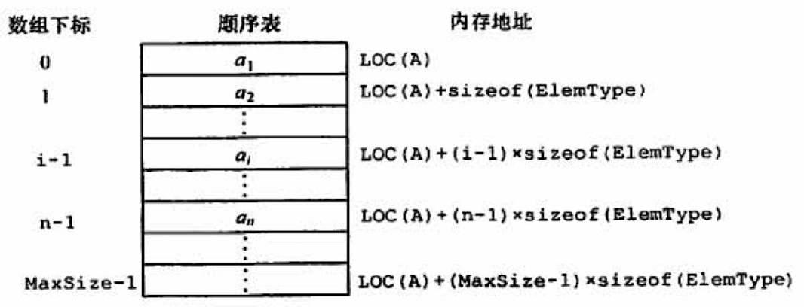

注意: 线性表中的元素的位序从1开始的,而数组中元素的下标是从0开始的

```c
#define MaxSize 50//定义线性表的最大长度
typedef struct {
	ElemType data [MaxSize] ;//顺序表的元素
	int length;//顺序表的当前长度
}SqList;//顺序表的类型定义

```
一维数组可以是静态分配的,也可以是动态分配的.
C 的初始动态分配语句为:`L.data = (ElemType *)malloc(sizeof(ElemType)*InitSize);`

#### 2.2.2 顺序表上的基本操作的实现
(1)插入操作
在顺序表L的第i (1<=i<=L.length+1)个位置插入新元素e。若i的输入不合法，则返回false,表示插入失败;否则，将第i个元素及其后的所有元素依次往后移动一个位置，腾出一个空位置插入新元素e,顺序表长度增加1,插入成功，返回true.
```c
bool ListInsert (SqList &L, int i, ElemType e) {
	if(i<1| li>L.length+1)//判断i的范围是否有效
		return false;	
	if (L. length>=MaxSize)//当前存储空间已满，不能插入
		return false;
	for (int j=L. length;j>=i;j--)//将第i个元素及之后的元素后移
		L.data[j]=L.data[j-1];
	L.data[i-1]=e; //在位置i处放入e
	L. length++;//线性表长度加1
	return true;
	}
	//最好情况O(1)
	//最坏情况O(N)
	//平均 n/2
```

(2)删除操作
删除顺序表L中第i (1<=i<=L.length)个位置的元素，用引用变量e返回。若i的输入不合法，则返回false;否则，将被删元素赋给引用变量e,并将第i+1个元素及其后的所有元素依次往前移动一个位置，返回true. 
共移动: n-i个
```c
bool ListDelete(SqList &L, int i, Elemtype &e) {
	if(i<1||i>L.length)  //判断I的范围是否有效
		return false;
	e=L.data[i-1]; 				//将呗删除的元素赋值给e 
	for(int j=i;j<L.length;j++) //将第I个位置后的元素前移
		L.data[j-1] = L.data[j]; 
	L.length--;  //线性表长度减1
	return ture;
	//最好情况O(1)
	//最坏情况O(N)
	//平均(n-1)/2
```
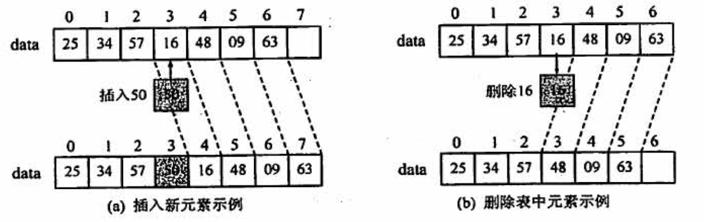

(3)按值查找(顺序查找)
在顺序表L中查找第一一个 元素值等于e的元素，并返回其位序。
```c
int LocateElem (SqList L, ElemType e){
	int i;
	for (i=0; i<L. length;i++)
		if(L.data[i]==e)
			return i+1;      //下标为i的元素值等于e,返回其位序i+1
		return 0;    //退出循环，说明查找失败
//最好情况O(1)
//最坏情况O(N)
//平均(n-1)/2
```

注意 :
>线性表的顺序存储结构是一种:随机存取的存储结构
>存取方式是指读写方式, 顺序表是一种支持随机存取的存储结构,根据起始地址加上元素的序号,可以方面的访问任意一个元素.

### 2.3 线性表的链式表示
####  2.3.1 单链表的定义
线性表的链式存储又称单链表.
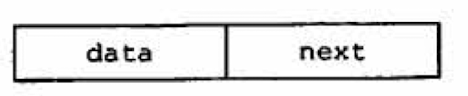
```c
typedef struct LNode{
	ElemType data; //数据域
	struct Lnode *next; //指针域
}Lnode, *LinkList; 
//其中,Lnode * = Linklist

```
由于单链表的元素离散地分布在存储空间中,所以单链表是非随机存取的存储结构, 即不能直接找到表中某个特定的结点. 查找某个特定的结点时,需要从表头开始便利,依次查找.

带头节点的单链表, 头指针为NULL时表示一个空表. 头结点的指针域指向线性表的第一个元素结点
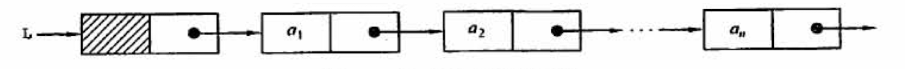

#### 2.3.2 单链表上基本操作的实现
1. 采用头插法建立单链表
该方法时从一个空表开始, 生成新结点, 并将读取到的数据存放到新结点的数据域中,然后将新结点插入到当前链表的表头,即头节点之后.
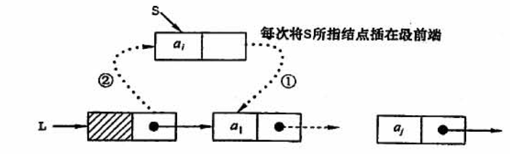
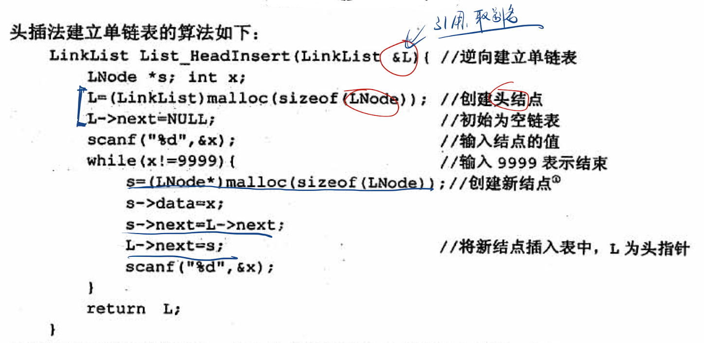
注意: 采用头插法建立单链表,读入数据的顺序与生成的链表中的元素的顺序是相反的, 每个结点插入的时间为0(1), 设单链表长为N, 则总时间复杂度为0(N)

2. 采用尾插法建立单链表
尾插法将新结点插入到当前链表的表尾,为此必须添加一个尾指针r, 使其始终指向当前链表的尾结点.
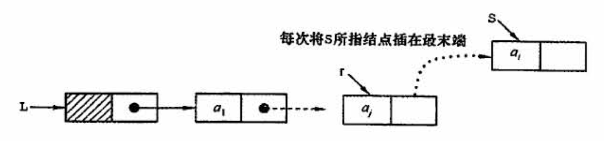

算法: 
```c
LinkList List_TailInsert(LinkList &L){
	int x;
	L=(LinkList)malloc(sizeof(LNode));
	LNode *s,*r=L; //r为表尾指针
	scanf("%d",&x); //输入结点的值
	while(x!=9999){
		s=(LNode *)malloc(sizeof(LNode));
		s->data = x;
		r->next=s;
		r=s;   //r指向新的表尾结点
		scanf("%d",&x);
	}
	r->next = NULL; //尾结点结点置空
	return L;
}
```

3. 按序号查找结点值
在单链表中从第一个结点出发,顺指针next 域逐个往下搜索,直到找到第i个结点为止,否则返回最后一个结点指针域NULL.

```c
LNode *GetElem(LinkList L, int i){
	int j=1; 
	LNode *p=L->next; //头结点指针赋给P
	if(i==0)
		return L; //若i等于0,则返回头结点
	if(i<1)
		return NULL; //若i无效,则返回NULL
	while(p&&j<i){
		//从第一个结点开始找, 查找第i个结点
		p=p->next;
		j++;
	}
	return p; //返回第i个结点的指针,若i大于表长,则返回NULL
}
```

4. 按值查找表结点
```c
LNode *LocateElem (LinkList L, ElemType e) {
	LNode *p=L- >next;
	while (p !=NULL&&p->data!=e) //从第一个结点开始查找data域为e的结点
	P=P- >next;
	return p;//找到后返回该结点指针，否则返回NULL
}

```

5. 插入结点操作
插入结点操作将值为X的新结点插入到单链表的第i个位置上, 先添加插入位置的合法性,然后找到待插入位置的前驱结点,即第i-1个结点,再在其后插入新结点.
首先调用按序号查找算法GetElem(L,i-1),查找第i-1个结点,假设返回的第i-1个结点为 * p,然后令新结点 * s的指针域指向 * p的后继结点, 再令结点 * p 的指针域指向新插入的结点 * s
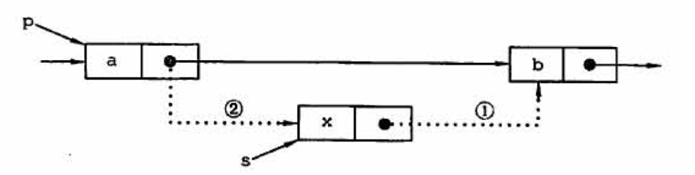
实现插入结点核心代码:
```c
p=GetElem(L,i-1); //查找插入位置的前驱结点
s->next = p->next; 
p->next = s;
```
扩展:对某一结点进行前插操作
前插操作是指在某结点的前面插入一个新结点, 后插操作的定义刚好相反. 在单链表插入算法中, 经常使用后插操作.
前插操作可以找i-1个结点,然后进行后插操作.
此外，可采用另一种方式将其转化为后插操作来实现，设待插入结点为 * s,将 * s插入到 * p的前面。我们仍然将 * s插入到 * p的后面，然后将p->data与s->data交换，这样既满足了逻辑关系，又能使得时间复杂度为0(1)。算法的代码片段如下:

```c
s -> next = p->next; 
p->next=s;
temp=p->data;//交换数据域部分
p->data=s->data;
s->data=temp;
```

6. 删除结点操作
查找表中第i-1个结点,即被删结点的前驱结点,再将其删除
```c
p=GetElem(L,i-1); //查找删除位置的前驱结点
q=p->next; //令q指向被删除结点
p->next = q->next; //将*q结点从链中段考
free(q); //释放结点的存储空间
```
扩展:删除结点 * p。
要删除某个给定结点 * p,通常的做法是先从链表的头结点开始顺序找到其前驱结点，然后执行删除操作，算法的时间复杂度为O(n)。
其实，删除结点 * p的操作可用删除 * p的后继结点操作来实现，实质就是将其后继结点的值赋予其自身，然后删除后继结点，也能使得时间复杂度为0(1)。

```c
q=p->next;//令q指向*p的后继结点
P- >data=p->next->data ;//和后继结点交换数据域
P->next=q->next;//将*q结点从链中“断开”
free (q) ;//释放后继结点的存储空间
```

7. 求表长操作
设置一个计数器变量,每次访问一个结点,计数器加1

#### 2.3.3 双链表
双链表有两个指针, prior 和 next  分别指向前驱结点、后继结点
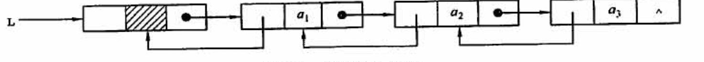

双链表描述:
```c
typedef struct DNode{
	ElemType data;  //数据域
	struct Dnode *prior,*next; //前驱和候机指针
}DNode, *DLinklist;
```
1. 双链表的插入操作
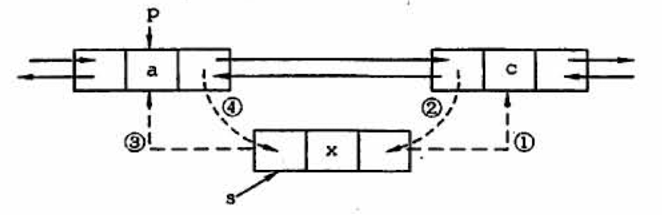

```c
s->next = p->next; //将结点*s插入到结点*p之后
p->next->prior=s;
s->prior=p;
p->next=s;
```

2. 双链表的删除操作
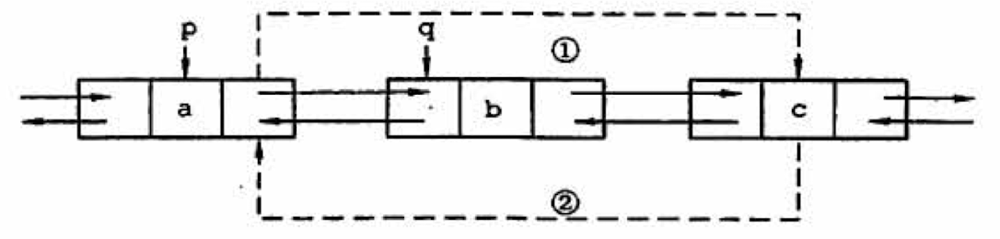

```c
p->next=q->next; //步骤1
q->next->prior=p; //步骤2
free(q);  

```

#### 2.3.4 循环链表
1. 循环单链表
循环单链表和单链表的区别在于,表中最后一个结点的指针不是NULL,而改为指向头结点,从而整个链表形成一个环.
再循环单链表中,表尾结点 * r的next域指向L, 表中没有指针域为NULL的结点,因此,循环单链表的判空条件不是头结点是否为空,**而是它是否等于头指针**
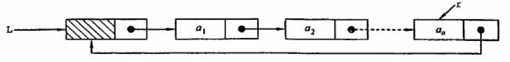

2. 循环双链表
在循环双链表中,某结点 * p 为尾结点时, `p->next==L` 当循环双链表为空表时,其头结点的`prior`域和`next`域都等于L.
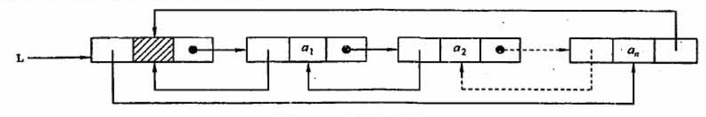

#### 3.5 静态链表
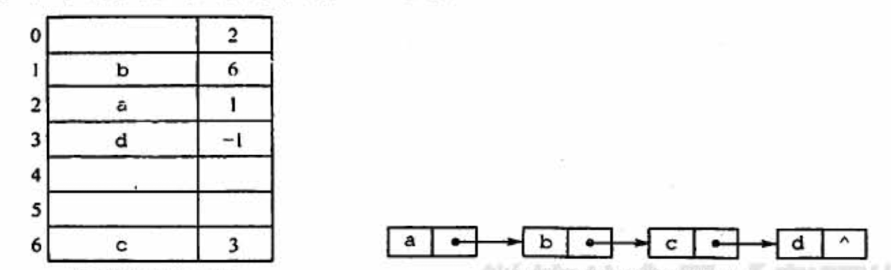


## 第三章 栈和队列
### 3.1 栈
#### 3.1.1 栈基本概念

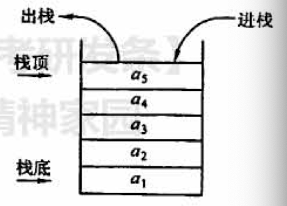
1. 定义
只能在一段进行操作的线性表.
特性: 后进先出

N个不同元素进栈.
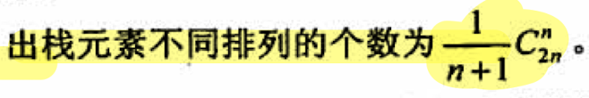
2. 栈的基本操作
```c
InitStack(&S)//初始化一个空栈S。
StackEmpty(S)//判断一个栈是否为空，若栈s为空则返回true，否则返回false.
Push(&S,x)//进栈，若栈s未满，则将x加入使之成为新栈顶。
Pop(&S,&x)//出栈，若栈s非空，则弹出栈顶元素，并用x返回。
GetTop(s,&x)//读栈项元素，若栈s非空，则用x返回栈顶元素。
DestroyStack(&S)//销毁栈，并释放栈s占用的存储空间(“&” 表示引用调用)。
```

#### 3.1.2 栈的顺序存储结构
1. 顺序栈的实现.
采用顺序存储的栈叫顺序栈, 利用一组地址连续的存储单元存放自栈底到栈顶的数据元素, 同时附设一个指针(top)指示当前栈顶的位置.
栈的顺序存储类型
```c
#define MaxSize 50 
typedef struct{
	ElemType data[MaxSize]; 
	int top;
}SqStack;
```

栈顶指针: `s. top`,初始时设置`s. top=-1`; 栈顶元素: `s. data[S. top]`
进栈操作:栈不满时，栈顶指针先加1,再送值到栈顶元素。
出栈操作:栈非空时，先取栈项元素值，再将栈顶指针减1.
栈空条件:` s. top==-1`;栈满条件: `S. top==MaxSize-1`;栈长:` s.top+1`.

2. 顺序栈的基本运算
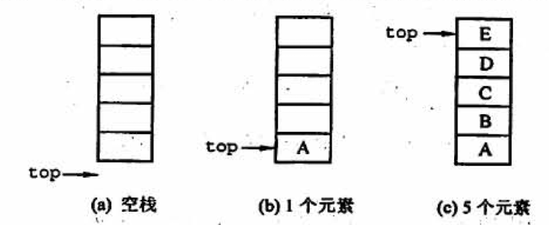

(1) 初始化
```c
void InitStack(SqStack &s){
	s.top=-1;//初始化指针5
}
```
(2)判栈空
```c
bool StackEmpty(SqStack S){
	if(S.top==-1)  //stack empty
		return true; 
	else 
		return false;
}
```
(3)进栈
```c
bool Push(SqStack &S,ElemType x){
	if(S.top == MaxSize-1)  //full stack, return error
		return false;
	S.data[++S.top] = x;  //指针先加1, 再入栈
	return true;
}
```
(4)出栈
```c
bool Pop(SqStack &S,ElemType &x){
	if(S.top==-1) //empty stack ,error
		return false;
	x=S.data[top--]; //先出栈,指针再减1
	return true;
}
```
(5)读栈顶元素
```c
bool GetTop(SqStack S,ElemType &x){
	if(S.top ==-1)
		return false;
	x = S.data[S.top];
	return true;
}

```

3. 共享栈

两个站的栈顶指针都指向栈顶元素, top0=-1时,0号栈为空, top1=MaxSize时,1号栈为空; 仅当两个站定指针相邻(top1-top0=1)时,判断为栈满.
当0号栈进栈时,top0先加1再赋值,1号栈进栈时,先减1再赋值; 出栈时刚好相反.

#### 3.1.3 栈的链式存储结构
链栈, 优点是便于多个栈共享存储空间和提高效率.
通常采用单链表实现, 并规定<u>所有操作都是在单链表的表头进行的</u>
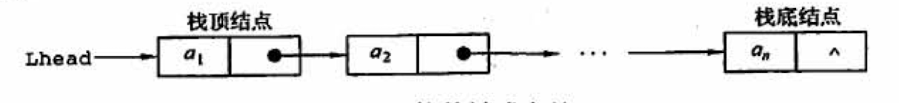

```c
typedef struct Linknode{
	ElemType data;
	struct Linknode *next; 
}*LiStack;
```

### 3.2 队列
#### 3.2.1 队列的基本概念
1. 队列定义
只允许在表的一端进行插入,而在表的另一段进行删除.
最早排队的也是最早离队的, 特性: 先进先出
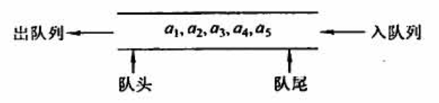

2. 队列常见的基本操作
```c
InitQueue (&Q)//初始化队列，构造-一个空队列Q。
QueueEmpty (Q)//判队列空，若队列Q为空返回true,否则返回false
EnQueue(&Q,x)//入队，若队列Q未满，将x加入，使之成为新的队尾
DeQueue (&Q, &x)//出队，若队列e非空，删除队头元素，并用x返回
GetHead(Q, &x)//读队头元素，若队列Q非空，则将队头元素赋值给X。

```
#### 3.2.2 队列的顺序存储结构
1. 队列的顺序存储
顺序实现:分配一块连续的存储单元存放队列中的元素,并附设两个指针: 队头指针`front`指向队头元素, 队尾指针`rear`指向队尾元素的下一个位置.

```c
	#define MaxSize 50
	typedef struct{
		ElemType data[MaxSize]; 
		int front, rear; //队头指针和队尾指针
	}SqQueue;
```
初始状态(队空条件): `Q. front==Q. rear==0`
进队操作:队不满时，<u>先送值到队尾元素，再将队尾指针加1</u>。
出队操作:队不空时，<u>先取队头元素值，再将队头指针加1</u>。

2. 循环队列
当队首指针 `Q.front = MaxSize-1`后,再前进一个位置就自动到0,这可以利用除法取余(%)来实现.
初始时:` Q. front=Q. rear=0`
队首指针迸1`Q. front= (Q. front+1) %MaxSize`
队尾指针进1:`Q. rear= (Q. rear+1) 8MaxSize`
队列长度: `(Q. rear+MaxSize-Q. front) 8MaxSize`

队空条件: `Q.front == Q.rear`
为了区别是队空开始队满,有三种处理方式:
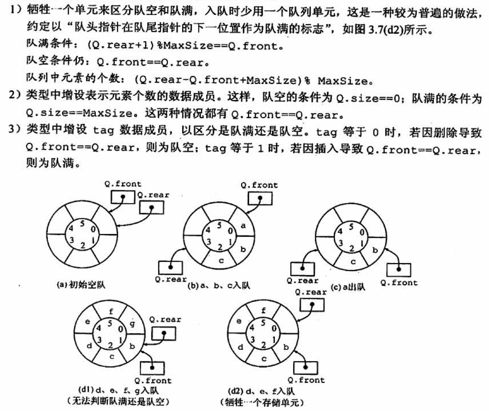

3. 循环队列的操作
(1)初始化
```c
void InitQueue(SqQueue &Q){
	Q.rear=Q.front=0;  //初始化队首、队尾指针
}
```
(2)判队空
```c
bool isEmpty(SqQueue Q){
	if(Q.rear ==Q.front)
		return true; //队空条件
		else return false;
}
```
(3)入队
```c
bool EnQueue(SqQueue &Q,EeleType x){
	if((Q.rear+1)%MaxSize==Q.front)
		return false; //队满则报错
	Q.data[Q.rear] = x;
	Q.rear=(Q.rea+1)%MaxSize;//队尾指针加1取模
	return true;
}
```

(4)出队
```c
bool DeQueue(SqQueue &Q,ElemType &x){
	if(Q.rear == Q.front)
		return false; //队空报错
	x=Q.data[Q.front];
	Q.front = (Q.front+1)%MaxSize; //队头指针加1取模
	return true;
}
```

#### 3.2.3 队列的链式存储结构
1. 队列的链式存储
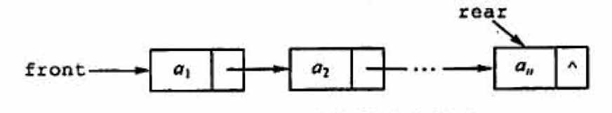
```c
typedef struct{
	ElemType data;
	struct LinkNode *next;
}LinkNode;
typedef struct{  //链式队列
	LinkNode *front,*rear; //队列的表头和队尾指针
}LinkQueue;
```
当`Q.front== NULL`且`Q.rear==NULL`时,链式队列为空.

带头结点的链式队列
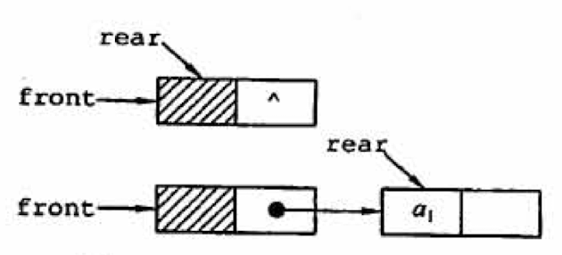


2. 链式队列的基本操作
(1)初始化
```c
void InitQueue(LinkQueue &Q){
	Q.front=Q.rear =(LnikNode*)malloc(sizeof(LinkNode)); //建立头结点
	Q.front->next=NULL; //初始为空
}
```
(2)判队空
```c
bool IsEmpty(LinkQueue Q){
	if(Q.front==Q.rear)
		return true;
	else 
		return false;
}
```
(3)入队
```c
void EnQueue(LinkQueue &Q,ElemType x){
	LinkNode *s=(LinkNode *)malloc(sizeof(LinkNode));
	s->data=x;s->next=NULL; //创建新结点,插入到链尾
	Q.rear->next=s;
	Q.rear=s;
}
```
(4)出队
```c
bool DeQueue(LinkQueue &Q,ElemType &x){
	if(Q.front==Q.rear)
		return false; //空队
	LinkNode *p=Q.front->next;
	x=p->data;
	Q.front->next=p->next;
	if(Q.rear==p)
		Q.rear=Q.front; //若原队列只有一个结点, 删除后变空
	free(p);
	return true;
}
```

#### 3.2.4两端队列
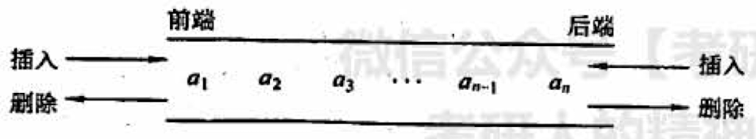
允许在一端进行插入和删除,但在另一段只允许插入的两端队列称为:输出受限的两端队列.

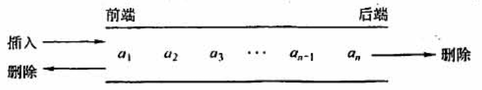


### 3.3 栈和队列的应用
#### 3.3.1 栈在括号中的应用
括号成对抵消

#### 3.3.2 栈在表达式求值中的应用
1. 口诀
>后缀是符号进栈
>中缀是字母进栈
>栈顶元素比要进的(高或等于)就出.

2. 中缀、后缀表达式
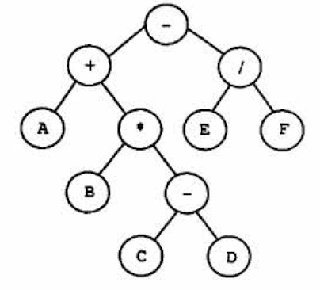
中缀表达式:1+B * (C-D)-E/F
后缀表达式:ABCD- * +EF/-

3. 通过后缀表示计算表达式值的过程为:
顺序扫描表达式的每一项， 然后根据它的类型做如下相应操作:若该项是操作数，则将其压入栈中:若该项是操作符 < op > ,
则连续从栈中退出两个操作数Y和x,形成运算指令X < op > Y,并将计算结果重新压入栈中。当表达式的所有项都扫描并处理完后，栈顶存放的就是最后的计算结果。
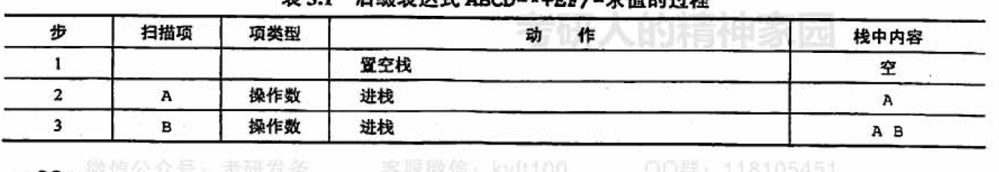
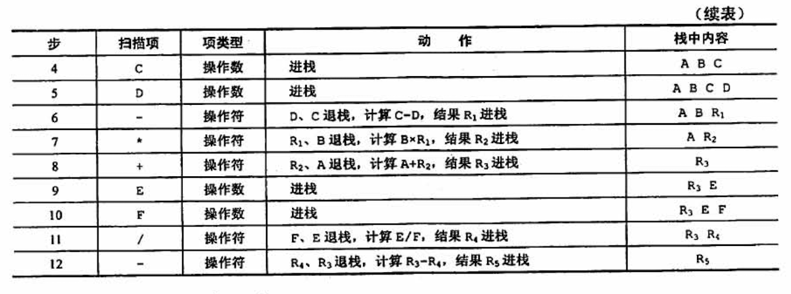

4. 中缀转后缀方法
a+b - a * ( (c+d) /e-f) +g
